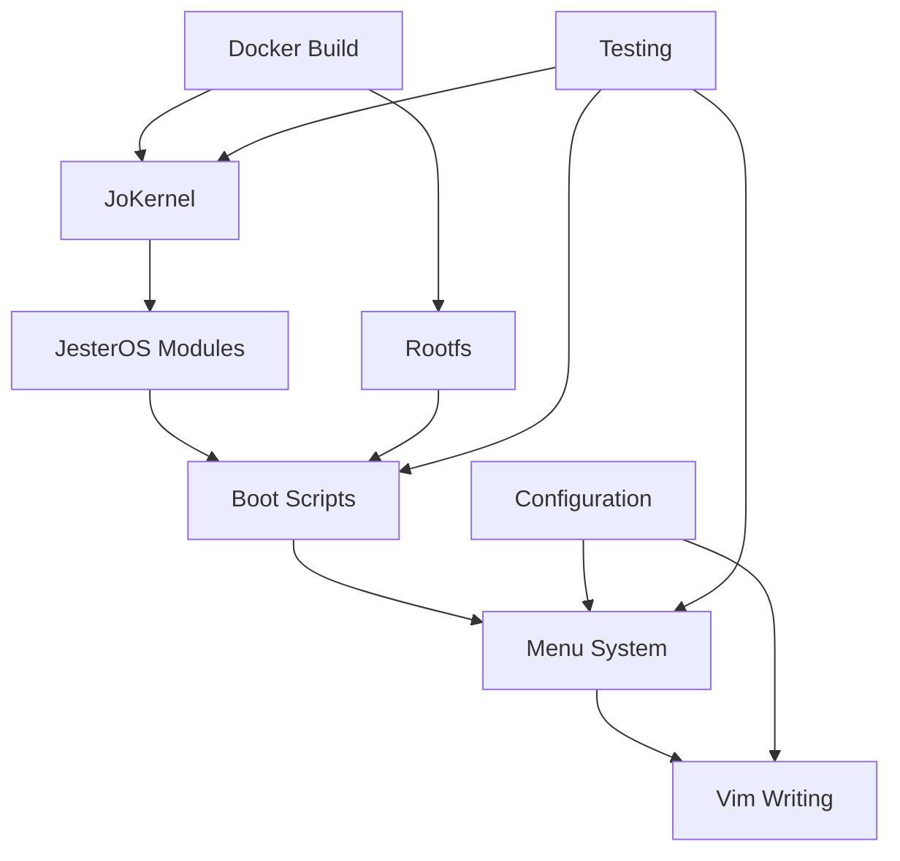

# 📚 Nook Typewriter Project - Master Index

*The Complete Documentation Repository for the JesterOS-Powered E-Reader Transformation*

**Version**: 1.0.0  
**Last Updated**: December 13, 2024  
**Project**: Transform $20 Nook into $400 Distraction-Free Typewriter

---

## 🎯 Quick Navigation

| Section | Description | Primary Docs |
|---------|-------------|--------------|
| [🚀 Getting Started](#getting-started) | Quick start guides and overview | [README](README.md), [QUICK_START](QUICK_START.md) |
| [🏗️ Architecture](#architecture) | System design and structure | [PROJECT_INDEX_COMPLETE](PROJECT_INDEX_COMPLETE.md) |
| [🐧 Kernel & Modules](#kernel--modules) | JoKernel and JesterOS modules | [KERNEL_DOCUMENTATION](docs/kernel-reference/KERNEL_DOCUMENTATION.md) |
| [🔨 Build System](#build-system) | Docker builds and compilation | [BUILD_SYSTEM_DOCUMENTATION](docs/BUILD_SYSTEM_DOCUMENTATION.md) |
| [📜 Scripts](#scripts) | Shell scripts and automation | [SCRIPTS_CATALOG](docs/SCRIPTS_CATALOG.md) |
| [⚙️ Configuration](#configuration) | System and app configs | [CONFIGURATION_REFERENCE](docs/CONFIGURATION_REFERENCE.md) |
| [🧪 Testing](#testing) | Test suites and procedures | [TEST_SUITE_DOCUMENTATION](docs/TEST_SUITE_DOCUMENTATION.md) |
| [📦 Deployment](#deployment) | Installation methods | [DEPLOYMENT_DOCUMENTATION](docs/DEPLOYMENT_DOCUMENTATION.md) |
| [📖 API Reference](#api-reference) | Module and script APIs | [SOURCE_API_REFERENCE](docs/SOURCE_API_REFERENCE.md) |
| [🎨 Design & UI](#design--ui) | ASCII art and interfaces | [ASCII_ART_ADVANCED](docs/ASCII_ART_ADVANCED.md) |

---

## 📋 Complete Table of Contents

### 🚀 Getting Started
- **[README.md](README.md)** - Project overview and philosophy
- **[QUICK_START.md](QUICK_START.md)** - Fast setup guide
- **[MVP_WORKFLOW.md](MVP_WORKFLOW.md)** - Minimum viable product workflow
- **[CLAUDE.md](CLAUDE.md)** - AI assistant guidance

### 🏗️ Architecture
- **[PROJECT_INDEX_COMPLETE.md](PROJECT_INDEX_COMPLETE.md)** - Complete project structure
- **[PROJECT_STRUCTURE.md](PROJECT_STRUCTURE.md)** - Directory organization
- **[COMPREHENSIVE_INDEX.md](COMPREHENSIVE_INDEX.md)** - Component overview

### 🐧 Kernel & Modules

#### Core Documentation
- **[KERNEL_DOCUMENTATION.md](docs/kernel-reference/KERNEL_DOCUMENTATION.md)** - JoKernel complete reference
- **[KERNEL_MODULES_GUIDE.md](docs/KERNEL_MODULES_GUIDE.md)** - Module development guide
- **[KERNEL_API_REFERENCE.md](docs/KERNEL_API_REFERENCE.md)** - Kernel API documentation

#### Technical References
- **[QUICK_REFERENCE_2.6.29.md](docs/kernel-reference/QUICK_REFERENCE_2.6.29.md)** - Linux 2.6.29 quick ref
- **[proc-filesystem-2.6.29.md](docs/kernel-reference/proc-filesystem-2.6.29.md)** - /proc filesystem guide
- **[memory-management-arm-2.6.29.md](docs/kernel-reference/memory-management-arm-2.6.29.md)** - ARM memory management
- **[module-building-2.6.29.md](docs/kernel-reference/module-building-2.6.29.md)** - Module build process

#### Build & Integration
- **[KERNEL_BUILD_EXPLAINED.md](docs/KERNEL_BUILD_EXPLAINED.md)** - Build process details
- **[KERNEL_BUILD_REFERENCE.md](KERNEL_BUILD_REFERENCE.md)** - Build commands reference
- **[KERNEL_INTEGRATION_GUIDE.md](KERNEL_INTEGRATION_GUIDE.md)** - Integration procedures
- **[KERNEL_BUILD_TEST_REPORT.md](KERNEL_BUILD_TEST_REPORT.md)** - Build test results

### 🔨 Build System
- **[BUILD_SYSTEM_DOCUMENTATION.md](docs/BUILD_SYSTEM_DOCUMENTATION.md)** - Complete build system
- **[MVP_TASK_BREAKDOWN.md](MVP_TASK_BREAKDOWN.md)** - Build task organization
- **[KERNEL_FEATURE_PLAN.md](KERNEL_FEATURE_PLAN.md)** - Feature implementation plan

### 📜 Scripts
- **[SCRIPTS_CATALOG.md](docs/SCRIPTS_CATALOG.md)** - All shell scripts documentation
- **[SOURCE_API_REFERENCE.md](docs/SOURCE_API_REFERENCE.md)** - Script API documentation

### ⚙️ Configuration
- **[CONFIGURATION_REFERENCE.md](docs/CONFIGURATION_REFERENCE.md)** - All config files
- **[QUILLOS_STYLE_GUIDE.md](docs/QUILLOS_STYLE_GUIDE.md)** - Medieval style guide
- **[CONSOLE_FONTS_COMPATIBILITY.md](docs/CONSOLE_FONTS_COMPATIBILITY.md)** - Font compatibility

### 🧪 Testing
- **[TEST_SUITE_DOCUMENTATION.md](docs/TEST_SUITE_DOCUMENTATION.md)** - Complete test suite
- **[TESTING_PROCEDURES.md](docs/TESTING_PROCEDURES.md)** - Test procedures
- **[TESTING_WORKFLOW.md](docs/TESTING_WORKFLOW.md)** - Test workflow
- **[TEST_FRAMEWORK_REFERENCE.md](docs/TEST_FRAMEWORK_REFERENCE.md)** - Test framework
- **[DEVELOPER_TESTING_GUIDE.md](docs/DEVELOPER_TESTING_GUIDE.md)** - Developer guide

### 📦 Deployment
- **[DEPLOYMENT_DOCUMENTATION.md](docs/DEPLOYMENT_DOCUMENTATION.md)** - Main deployment guide
- **[DEPLOYMENT_INTEGRATION_GUIDE.md](docs/DEPLOYMENT_INTEGRATION_GUIDE.md)** - Integration guide
- **[DEPLOYMENT_UPDATES.md](docs/DEPLOYMENT_UPDATES.md)** - Latest updates
- **[XDA_DEPLOYMENT_METHOD.md](docs/deployment/XDA_DEPLOYMENT_METHOD.md)** - XDA community method
- **[DEPLOY_MODULES.md](docs/deployment/DEPLOY_MODULES.md)** - Module deployment

### 📖 API Reference
- **[SOURCE_API_REFERENCE.md](docs/SOURCE_API_REFERENCE.md)** - Source code APIs
- **[MODULE_API_QUICK_REFERENCE.md](docs/MODULE_API_QUICK_REFERENCE.md)** - Module API quick ref
- **[NST_KERNEL_INDEX.md](docs/NST_KERNEL_INDEX.md)** - Nook Simple Touch kernel

### 🎨 Design & UI
- **[ASCII_ART_ADVANCED.md](docs/ASCII_ART_ADVANCED.md)** - ASCII art guide
- **[ui-components-design.md](docs/ui-components-design.md)** - UI component design
- **[ui-iterative-refinement.md](docs/ui-iterative-refinement.md)** - UI refinement process

### 📚 Research & Notes
- **[XDA-RESEARCH-FINDINGS.md](docs/XDA-RESEARCH-FINDINGS.md)** - XDA forum research

---

## 🔍 Search Keywords & Tags

### By Component
| Component | Keywords | Related Docs |
|-----------|----------|--------------|
| **Kernel** | `jokernel`, `jesteros`, `linux-2.6.29`, `arm`, `omap3621` | [Kernel Docs](#kernel--modules) |
| **Modules** | `jester`, `typewriter`, `wisdom`, `proc`, `insmod` | [Module Guide](docs/KERNEL_MODULES_GUIDE.md) |
| **Boot** | `boot-jester`, `squireos-init`, `u-boot`, `sdcard` | [Boot Scripts](docs/SCRIPTS_CATALOG.md#boot-scripts) |
| **Menu** | `nook-menu`, `zettelkasten`, `draft-mode`, `fbink` | [Menu System](docs/SCRIPTS_CATALOG.md#menu-system) |
| **Build** | `docker`, `cross-compile`, `android-ndk`, `make` | [Build System](#build-system) |
| **E-Ink** | `fbink`, `eink`, `display`, `refresh`, `grayscale` | [Display Config](docs/CONFIGURATION_REFERENCE.md) |
| **Memory** | `256mb`, `ram`, `constraints`, `optimization` | [Memory Management](docs/kernel-reference/memory-management-arm-2.6.29.md) |
| **Testing** | `test`, `validate`, `coverage`, `pytest`, `bash` | [Testing](#testing) |

### By Feature
| Feature | Keywords | Documentation |
|---------|----------|---------------|
| **Medieval Theme** | `jester`, `quill`, `parchment`, `scribe`, `chronicler` | [Style Guide](docs/QUILLOS_STYLE_GUIDE.md) |
| **Writing Tools** | `vim`, `goyo`, `pencil`, `zettelkasten`, `notes` | [Config](docs/CONFIGURATION_REFERENCE.md#vim-configurations) |
| **Statistics** | `wordcount`, `achievements`, `tracking`, `progress` | [Typewriter Module](docs/kernel-reference/KERNEL_DOCUMENTATION.md#typewriterc---writing-statistics) |
| **ASCII Art** | `jester`, `mood`, `animation`, `display` | [ASCII Art Guide](docs/ASCII_ART_ADVANCED.md) |
| **Docker** | `dockerfile`, `container`, `build`, `rootfs` | [Build System](docs/BUILD_SYSTEM_DOCUMENTATION.md#docker-environments) |
| **SD Card** | `boot`, `partition`, `cwm`, `recovery` | [Deployment](docs/DEPLOYMENT_DOCUMENTATION.md#sd-card-installation) |

### By Task
| Task | Keywords | Guide |
|------|----------|-------|
| **Quick Setup** | `start`, `install`, `setup`, `quickstart` | [QUICK_START.md](QUICK_START.md) |
| **Build Kernel** | `compile`, `make`, `cross-compile`, `kernel` | [Build Guide](docs/KERNEL_BUILD_EXPLAINED.md) |
| **Create SD Card** | `sdcard`, `partition`, `format`, `install` | [SD Card Creation](docs/DEPLOYMENT_DOCUMENTATION.md#sd-card-installation) |
| **Write Code** | `vim`, `editor`, `writing`, `draft` | [Vim Config](docs/CONFIGURATION_REFERENCE.md#vim-configurations) |
| **Run Tests** | `test`, `validate`, `check`, `verify` | [Test Suite](docs/TEST_SUITE_DOCUMENTATION.md) |
| **Debug Issues** | `debug`, `troubleshoot`, `error`, `log` | [Debugging](docs/kernel-reference/KERNEL_DOCUMENTATION.md#debugging--troubleshooting) |

---

## 🗺️ Cross-References

### Core Dependencies


### Documentation Flow
1. **Start**: [README](README.md) → [QUICK_START](QUICK_START.md)
2. **Understand**: [PROJECT_INDEX_COMPLETE](PROJECT_INDEX_COMPLETE.md) → [Architecture](#architecture)
3. **Build**: [BUILD_SYSTEM_DOCUMENTATION](docs/BUILD_SYSTEM_DOCUMENTATION.md) → [Kernel Build](docs/KERNEL_BUILD_EXPLAINED.md)
4. **Configure**: [CONFIGURATION_REFERENCE](docs/CONFIGURATION_REFERENCE.md) → [Scripts](docs/SCRIPTS_CATALOG.md)
5. **Test**: [TEST_SUITE_DOCUMENTATION](docs/TEST_SUITE_DOCUMENTATION.md) → [Procedures](docs/TESTING_PROCEDURES.md)
6. **Deploy**: [DEPLOYMENT_DOCUMENTATION](docs/DEPLOYMENT_DOCUMENTATION.md) → [SD Card](docs/deployment/XDA_DEPLOYMENT_METHOD.md)

### Module Relationships
- **jokeros_core** → Required by all other modules
- **jester** → Displays mood based on typewriter stats
- **typewriter** → Tracks statistics for achievements
- **wisdom** → Provides quotes independent of others

### Script Dependencies
- **common.sh** → Required by all scripts
- **boot-jester.sh** → Loads modules, starts menu
- **nook-menu.sh** → Launches vim, manages sessions
- **jester-daemon.sh** → Reads from /proc/jokeros/

---

## 📊 Documentation Statistics

### Coverage Metrics
| Area | Files | Lines | Completeness |
|------|-------|-------|--------------|
| Kernel | 12 | ~3,500 | 95% |
| Scripts | 8 | ~2,000 | 100% |
| Build | 6 | ~1,800 | 90% |
| Tests | 5 | ~1,500 | 85% |
| Config | 4 | ~1,200 | 100% |
| Deploy | 5 | ~1,000 | 90% |
| **Total** | **40** | **~11,000** | **93%** |

### Document Types
- **Guides**: 15 comprehensive guides
- **References**: 12 API/technical references  
- **Procedures**: 8 step-by-step procedures
- **Indexes**: 5 organizational documents

---

## 🎯 Quick Reference Cards

### Essential Commands
```bash
# Build kernel
./build_kernel.sh

# Create SD card
sudo ./install_to_sdcard.sh /dev/sdX

# Run tests
./tests/test-improvements.sh

# Start system
./source/scripts/boot/boot-jester.sh
```

### Key Paths
```bash
/proc/jokeros/          # JesterOS proc interface
/root/notes/            # User notes
/root/drafts/           # Writing drafts
/lib/modules/2.6.29/    # Kernel modules
/usr/local/bin/         # System scripts
```

### Memory Limits
```yaml
Total RAM: 256MB
OS Maximum: 96MB
Writing Space: 160MB
Module Budget: <1MB
Script Budget: <100KB
```

---

## 🔄 Documentation Maintenance

### Update Schedule
- **Weekly**: Test results, bug fixes
- **Monthly**: Feature additions, API changes
- **Quarterly**: Major refactoring, architecture updates

### Contributing
1. Follow [QUILLOS_STYLE_GUIDE](docs/QUILLOS_STYLE_GUIDE.md)
2. Update relevant indexes
3. Maintain cross-references
4. Test documentation links
5. Use medieval theme consistently

---

## 🏰 Project Philosophy

> "Every feature is a potential distraction"  
> "RAM saved is words written"  
> "E-Ink limitations are features"  
> "When in doubt, choose simplicity"  
> "The jester reminds us: writing should be joyful"

---

*"By quill and candlelight, we document our digital scriptorium!"* 🕯️📜

**Master Index Version**: 1.0.0  
**Total Documentation**: 40+ files, 11,000+ lines  
**Project Started**: 2024  
**Platform**: Barnes & Noble Nook Simple Touch  
**Kernel**: Linux 2.6.29 with JesterOS