# Parallel MVP Execution Plan - Multi-Agent Orchestration

**Epic ID**: QUILL-PARALLEL-001  
**Strategy**: Parallel Execution with Multi-Agent Delegation  
**Created**: August 11, 2024  
**Status**: Ready for Execution  
**Estimated Duration**: 3-4 days (vs 5-7 sequential)  
**Agent Count**: 3-4 concurrent agents

---

## 🚀 Parallel Execution Overview

### Acceleration Strategy
By running independent work streams in parallel with specialized agents, we can reduce the MVP timeline by 40-50%.

### Agent Allocation
- **Agent Alpha**: Kernel Integration Specialist
- **Agent Beta**: Rootfs Builder
- **Agent Gamma**: Testing & Validation
- **Agent Delta**: Documentation & Coordination (optional)

---

## 📊 Parallel Work Stream Breakdown

## Stream A: Kernel Integration [AGENT-ALPHA]
**Duration**: Day 1-2  
**Can Start**: Immediately  
**Dependencies**: None  
**Specialization**: Backend/Architect persona

### Delegated Tasks
```yaml
Task Set A1: Module Integration
  Owner: Agent Alpha
  Parallel: No (within stream)
  Duration: 3-4 hours
  Commands:
    - Add modules to kernel Makefile
    - Create Kconfig entries
    - Fix 2.6.29 compatibility issues
    
Task Set A2: Kernel Build
  Owner: Agent Alpha  
  Parallel: No (depends on A1)
  Duration: 2-3 hours
  Commands:
    - Create quillkernel_defconfig
    - Build kernel with Docker
    - Verify uImage output
```

### Agent Alpha Execution Command
```bash
/sc:task execute KERNEL-STREAM --delegate --agent alpha --persona backend \
  --tasks "QUILL-T001,QUILL-T002,QUILL-T003" --validate
```

---

## Stream B: Rootfs Creation [AGENT-BETA]
**Duration**: Day 1-2  
**Can Start**: Immediately (PARALLEL with Stream A)  
**Dependencies**: None  
**Specialization**: DevOps persona

### Delegated Tasks
```yaml
Task Set B1: Minimal Debian Build
  Owner: Agent Beta
  Parallel: Yes (with Stream A)
  Duration: 3-4 hours
  Commands:
    - Create minimal-boot.dockerfile
    - Build ultra-minimal Debian
    - Add init scripts
    
Task Set B2: Packaging
  Owner: Agent Beta
  Parallel: No (depends on B1)
  Duration: 1-2 hours
  Commands:
    - Export container
    - Create tar.gz archive
    - Verify contents
```

### Agent Beta Execution Command
```bash
/sc:task execute ROOTFS-STREAM --delegate --agent beta --persona devops \
  --tasks "QUILL-T004,QUILL-T005,QUILL-T006" --validate
```

---

## Stream C: Environment Preparation [AGENT-GAMMA]
**Duration**: Day 2  
**Can Start**: After initial progress from A & B  
**Dependencies**: Partial outputs from A & B  
**Specialization**: QA/DevOps persona

### Delegated Tasks
```yaml
Task Set C1: Testing Environment
  Owner: Agent Gamma
  Parallel: Can start early
  Duration: 2 hours
  Commands:
    - Prepare SD card reader
    - Setup serial console
    - Prepare test scripts
    
Task Set C2: Integration Prep
  Owner: Agent Gamma
  Parallel: No
  Duration: 1 hour
  Commands:
    - Validate build outputs
    - Prepare deployment scripts
    - Create test checklist
```

### Agent Gamma Execution Command
```bash
/sc:task execute TEST-PREP-STREAM --delegate --agent gamma --persona qa \
  --tasks "test-environment-setup" --validate
```

---

## 🔄 Convergence Point: Day 2-3

After parallel streams complete, all agents converge for integration:

## Stream D: Integration & Deployment [ALL-AGENTS]
**Duration**: Day 2-3  
**Dependencies**: Streams A & B must complete  
**Coordination**: All agents collaborate

### Synchronized Tasks
```yaml
Task Set D1: SD Card Preparation
  Owner: Agent Alpha (lead) + Beta (assist)
  Duration: 2 hours
  Synchronization: Required
  Commands:
    - Partition SD card
    - Install kernel (Alpha provides)
    - Install rootfs (Beta provides)
    
Task Set D2: First Boot Test
  Owner: Agent Gamma (lead) + All (observe)
  Duration: 2-3 hours
  Synchronization: Required
  Commands:
    - Insert SD card
    - Monitor boot
    - Verify /proc/squireos
    - Test USB (if time)
```

### Convergence Command
```bash
/sc:task converge QUILL-PARALLEL-001 --agents "alpha,beta,gamma" \
  --synchronize --tasks "QUILL-T007,QUILL-T008,QUILL-T009,QUILL-T010"
```

---

## 📈 Parallel Execution Timeline

```mermaid
gantt
    title Parallel MVP Execution Timeline
    dateFormat HH:mm
    section Agent Alpha
    Module Integration    :a1, 00:00, 3h
    Kernel Build         :a2, after a1, 2h
    SD Card (lead)       :a3, 08:00, 2h
    
    section Agent Beta
    Rootfs Build         :b1, 00:00, 3h
    Packaging            :b2, after b1, 2h
    SD Card (assist)     :b3, 08:00, 2h
    
    section Agent Gamma
    Test Prep            :c1, 03:00, 2h
    Integration Prep     :c2, after c1, 1h
    Boot Test (lead)     :c3, after a3, 3h
    
    section Convergence
    Final Validation     :d1, after c3, 2h
```



---

## 🎯 Multi-Agent Coordination Protocol

### Communication Channels
```yaml
Primary Channel: Task status updates via /sc:task status
Sync Points: Every 2 hours or at task completion
Conflict Resolution: Agent Alpha has priority for kernel decisions
Resource Sharing: Build artifacts shared via mounted volumes
```

### Agent Specializations
| Agent | Primary Focus | Secondary Skills | Persona |
|-------|--------------|------------------|---------|
| Alpha | Kernel, C code | Build systems | Backend/Architect |
| Beta | Docker, Linux | Packaging | DevOps |
| Gamma | Testing, Validation | Documentation | QA |
| Delta | Coordination | Progress tracking | Project Manager |

### Handoff Points
1. **A→D**: Kernel uImage ready → SD card installation
2. **B→D**: Rootfs archive ready → SD card extraction
3. **C→D**: Test environment ready → Hardware testing
4. **All→Delta**: Status updates → Documentation

---

## 🚦 Quality Gates & Synchronization

### Parallel Execution Gates
- **Gate 1**: Both kernel and rootfs build successfully (Day 1)
- **Gate 2**: All artifacts validated before SD card (Day 2)
- **Gate 3**: Convergence readiness check (Day 2)
- **Gate 4**: Boot success before proceeding (Day 3)

### Synchronization Requirements
```yaml
Hard Sync Points:
  - SD card preparation (needs both kernel + rootfs)
  - Hardware testing (all agents observe)
  - Final validation (consensus required)
  
Soft Sync Points:
  - Every 2 hours for progress updates
  - On any blocking issues
  - Before major decisions
```

---

## 📊 Performance Metrics

### Parallel Execution Targets
- **Time Reduction**: 40-50% vs sequential
- **Agent Utilization**: >70% active time
- **Sync Overhead**: <10% of total time
- **Quality Maintained**: Same validation standards

### Success Criteria
- [ ] All parallel streams complete independently
- [ ] Convergence happens smoothly
- [ ] No resource conflicts between agents
- [ ] MVP boots successfully
- [ ] Total time ≤ 4 days

---

## 🔧 Agent Execution Commands

### Launch All Parallel Agents
```bash
# Master orchestration command
/sc:spawn parallel-mvp --agents 3 --strategy parallel --auto-assign

# Or individual agent launches
/sc:task execute QUILL-PARALLEL-001 --stream A --delegate --agent alpha &
/sc:task execute QUILL-PARALLEL-001 --stream B --delegate --agent beta &
/sc:task execute QUILL-PARALLEL-001 --stream C --delegate --agent gamma &

# Monitor all agents
/sc:task status QUILL-PARALLEL-001 --all-agents --real-time
```

### Fallback to Sequential
```bash
# If parallel execution has issues
/sc:task fallback QUILL-PARALLEL-001 --strategy sequential --merge-progress
```

---

## 🎨 Delegation Patterns

### Pattern 1: Domain Specialization
```bash
/sc:task delegate --by-domain
# Kernel tasks → Backend specialist
# Rootfs tasks → DevOps specialist
# Testing tasks → QA specialist
```

### Pattern 2: File-Based Delegation
```bash
/sc:task delegate --by-files
# Each .c file → Different agent
# Parallel compilation and testing
```

### Pattern 3: Wave-Based Delegation
```bash
/sc:task delegate --wave-mode --waves 3
# Wave 1: Analysis (all agents)
# Wave 2: Implementation (parallel)
# Wave 3: Validation (convergence)
```

---

## 📝 Risk Mitigation

### Parallel Execution Risks
1. **Resource Conflicts**: Agents trying to modify same files
   - **Mitigation**: Clear ownership boundaries
   
2. **Synchronization Issues**: Agents out of sync
   - **Mitigation**: Regular sync points, status checks
   
3. **Communication Overhead**: Too much coordination
   - **Mitigation**: Autonomous execution within streams
   
4. **Quality Compromise**: Rush to complete
   - **Mitigation**: Same validation gates as sequential

---

## ✅ Quick Start

To launch parallel execution immediately:

```bash
# Option 1: Single command orchestration
/sc:task execute QUILL-PARALLEL-001 --delegate --parallel --agents 3

# Option 2: Manual agent assignment
/sc:spawn agent --name alpha --task "Kernel Integration" --persona backend
/sc:spawn agent --name beta --task "Rootfs Creation" --persona devops
/sc:spawn agent --name gamma --task "Test Preparation" --persona qa

# Option 3: Wave-based parallel execution
/sc:workflow MVP_WORKFLOW.md --wave-mode --parallel --delegate
```

---

## 📈 Expected Outcomes

### Timeline Comparison
| Approach | Duration | Agent Hours | Wall Time |
|----------|----------|-------------|-----------|
| Sequential | 5-7 days | 24-34 hours | 5-7 days |
| **Parallel** | **3-4 days** | **24-34 hours** | **3-4 days** |
| Savings | 2-3 days | Same effort | 40-50% faster |

### Resource Utilization
- Sequential: 1 agent at 100%
- Parallel: 3 agents at 70-80% each
- Efficiency gain: 2.1-2.4x throughput

---

*"By coordinating our quills, we write faster than any single scribe!"* 🪶🪶🪶

**Parallel Execution Plan Ready**  
**Estimated Acceleration**: 40-50%  
**Launch Command**: `/sc:task execute QUILL-PARALLEL-001 --delegate --parallel`