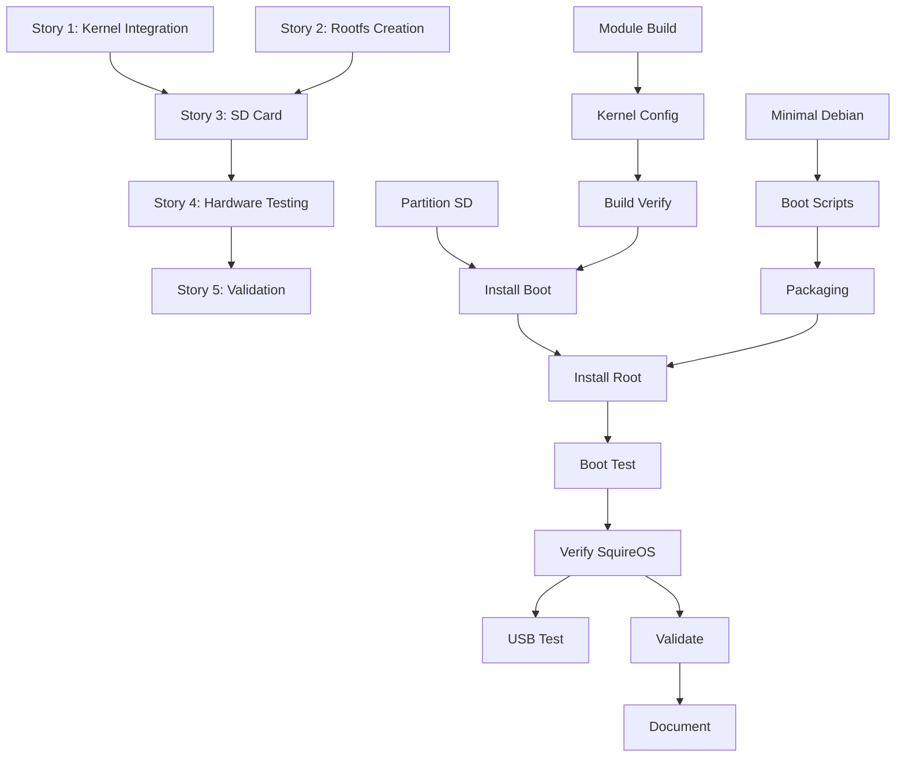

# Task Hierarchy: Complete QuillKernel MVP Boot

**Epic ID**: QUILL-MVP-001  
**Strategy**: Systematic  
**Created**: August 11, 2024  
**Status**: Active  
**Persistence**: Enabled  
**Estimated Duration**: 5-7 days

---

## 📊 Epic Overview

### Success Criteria
- [ ] Kernel boots successfully on Nook hardware
- [ ] /proc/squireos interface accessible
- [ ] Jester ASCII art appears during boot
- [ ] Basic menu system launches
- [ ] USB keyboard detected (stretch goal)

### Risk Assessment
- **Technical Risk**: Medium (kernel compatibility issues possible)
- **Hardware Risk**: High (requires physical device testing)
- **Timeline Risk**: Low (reasonable 5-7 day estimate)

---

## 📋 Hierarchical Task Breakdown

## Story 1: Kernel Integration [QUILL-S001]
**Status**: In Progress  
**Priority**: Critical  
**Duration**: 1-2 days  
**Dependencies**: None (can start immediately)

### Task 1.1: Module Build Integration [QUILL-T001]
**Status**: Pending  
**Estimated Time**: 2-3 hours  
**Validation Gate**: Modules compile without errors

#### Subtasks:
- [ ] **1.1.1** Add squireos to drivers/Makefile (30 min)
  ```bash
  echo "obj-$(CONFIG_SQUIREOS) += ../../quillkernel/modules/" >> nst-kernel-base/src/drivers/Makefile
  ```
- [ ] **1.1.2** Create Kconfig entry for SquireOS (30 min)
- [ ] **1.1.3** Fix 2.6.29 kernel API compatibility (1-2 hours)
  - Update proc_create calls
  - Add version checks
  - Fix symbol exports

### Task 1.2: Kernel Configuration [QUILL-T002] 
**Status**: Pending  
**Estimated Time**: 1 hour  
**Dependencies**: T001  
**Validation Gate**: .config includes all required options

#### Subtasks:
- [ ] **1.2.1** Create quillkernel_defconfig (20 min)
- [ ] **1.2.2** Enable CONFIG_SQUIREOS=y (10 min)
- [ ] **1.2.3** Verify USB host mode enabled (10 min)
- [ ] **1.2.4** Test configuration with oldconfig (20 min)

### Task 1.3: Build Verification [QUILL-T003]
**Status**: Pending  
**Estimated Time**: 1-2 hours  
**Dependencies**: T002  
**Validation Gate**: uImage builds successfully

#### Subtasks:
- [ ] **1.3.1** Run Docker build script (30 min)
- [ ] **1.3.2** Verify uImage output (10 min)
- [ ] **1.3.3** Check module symbols with nm (20 min)
- [ ] **1.3.4** Validate module dependencies (20 min)

---

## Story 2: Minimal Rootfs Creation [QUILL-S002]
**Status**: Not Started  
**Priority**: Critical  
**Duration**: 2 days  
**Dependencies**: Can run parallel with S001

### Task 2.1: Create Ultra-Minimal Debian [QUILL-T004]
**Status**: Pending  
**Estimated Time**: 3 hours  
**Validation Gate**: Rootfs < 30MB compressed

#### Subtasks:
- [ ] **2.1.1** Write minimal-boot.dockerfile (1 hour)
- [ ] **2.1.2** Install only busybox-static & kmod (30 min)
- [ ] **2.1.3** Create init script for module loading (30 min)
- [ ] **2.1.4** Build and test in Docker (1 hour)

### Task 2.2: Boot Scripts Integration [QUILL-T005]
**Status**: Pending  
**Estimated Time**: 2 hours  
**Dependencies**: T004  
**Validation Gate**: Scripts execute in correct order

#### Subtasks:
- [ ] **2.2.1** Create /init with module loading (30 min)
- [ ] **2.2.2** Add MVP menu script (30 min)
- [ ] **2.2.3** Configure auto-launch sequence (30 min)
- [ ] **2.2.4** Test boot sequence in chroot (30 min)

### Task 2.3: Rootfs Packaging [QUILL-T006]
**Status**: Pending  
**Estimated Time**: 1 hour  
**Dependencies**: T005  
**Validation Gate**: .tar.gz created and valid

#### Subtasks:
- [ ] **2.3.1** Export Docker container (20 min)
- [ ] **2.3.2** Create compressed archive (20 min)
- [ ] **2.3.3** Verify archive contents (20 min)

---

## Story 3: SD Card Preparation [QUILL-S003]
**Status**: Not Started  
**Priority**: Critical  
**Duration**: 1 day  
**Dependencies**: S001 and S002 must complete

### Task 3.1: Partition SD Card [QUILL-T007]
**Status**: Pending  
**Estimated Time**: 1 hour  
**Validation Gate**: Partitions created correctly

#### Subtasks:
- [ ] **3.1.1** Create boot partition (32MB FAT32) (20 min)
- [ ] **3.1.2** Create root partition (remaining ext4) (20 min)
- [ ] **3.1.3** Verify partition table (20 min)

### Task 3.2: Install Bootloader & Kernel [QUILL-T008]
**Status**: Pending  
**Estimated Time**: 1 hour  
**Dependencies**: T007, T003  
**Validation Gate**: Boot files in place

#### Subtasks:
- [ ] **3.2.1** Copy uImage to boot partition (10 min)
- [ ] **3.2.2** Create uEnv.txt with boot args (20 min)
- [ ] **3.2.3** Verify U-Boot configuration (30 min)

### Task 3.3: Install Root Filesystem [QUILL-T009]
**Status**: Pending  
**Estimated Time**: 1 hour  
**Dependencies**: T008, T006  
**Validation Gate**: Rootfs extracted correctly

#### Subtasks:
- [ ] **3.3.1** Extract rootfs to root partition (20 min)
- [ ] **3.3.2** Copy kernel modules to /lib/modules (20 min)
- [ ] **3.3.3** Set permissions and ownership (20 min)

---

## Story 4: Hardware Testing [QUILL-S004]
**Status**: Not Started  
**Priority**: Critical  
**Duration**: 1-2 days  
**Dependencies**: S003 must complete

### Task 4.1: Initial Boot Test [QUILL-T010]
**Status**: Pending  
**Estimated Time**: 2 hours  
**Dependencies**: T009  
**Validation Gate**: Kernel boots without panic

#### Subtasks:
- [ ] **4.1.1** Insert SD card and power on (10 min)
- [ ] **4.1.2** Monitor serial console output (30 min)
- [ ] **4.1.3** Document boot messages (30 min)
- [ ] **4.1.4** Troubleshoot any kernel panics (30-60 min)

### Task 4.2: Verify SquireOS Interface [QUILL-T011]
**Status**: Pending  
**Estimated Time**: 1 hour  
**Dependencies**: T010  
**Validation Gate**: All /proc entries accessible

#### Subtasks:
- [ ] **4.2.1** Test /proc/squireos/version (10 min)
- [ ] **4.2.2** Verify jester ASCII art displays (10 min)
- [ ] **4.2.3** Check wisdom quotes rotation (10 min)
- [ ] **4.2.4** Test typewriter stats (if USB works) (30 min)

### Task 4.3: USB Keyboard Testing (Stretch) [QUILL-T012]
**Status**: Pending  
**Estimated Time**: 2 hours  
**Dependencies**: T011  
**Validation Gate**: Keyboard input detected

#### Subtasks:
- [ ] **4.3.1** Connect USB OTG adapter (10 min)
- [ ] **4.3.2** Attach USB keyboard (10 min)
- [ ] **4.3.3** Check dmesg for USB detection (20 min)
- [ ] **4.3.4** Verify typewriter tracking works (30 min)
- [ ] **4.3.5** Troubleshoot if not detected (30-60 min)

---

## Story 5: Validation & Documentation [QUILL-S005]
**Status**: Not Started  
**Priority**: High  
**Duration**: 1 day  
**Dependencies**: S004 must complete

### Task 5.1: Success Criteria Validation [QUILL-T013]
**Status**: Pending  
**Estimated Time**: 1 hour  
**Dependencies**: T011  
**Validation Gate**: All MVP criteria met

#### Subtasks:
- [ ] **5.1.1** Verify kernel boots (15 min)
- [ ] **5.1.2** Confirm /proc/squireos works (15 min)
- [ ] **5.1.3** Check jester displays (15 min)
- [ ] **5.1.4** Document any issues (15 min)

### Task 5.2: Create Documentation [QUILL-T014]
**Status**: Pending  
**Estimated Time**: 2 hours  
**Dependencies**: T013  
**Validation Gate**: README updated

#### Subtasks:
- [ ] **5.2.1** Document build process (30 min)
- [ ] **5.2.2** Create installation guide (30 min)
- [ ] **5.2.3** Write troubleshooting section (30 min)
- [ ] **5.2.4** Update project README (30 min)

---

## 🔄 Execution Order & Dependencies



---

## 📈 Progress Tracking

### Overall Progress
- **Stories Complete**: 0/5 (0%)
- **Tasks Complete**: 0/14 (0%)
- **Subtasks Complete**: 0/64 (0%)
- **Estimated Time Remaining**: 24-34 hours

### Current Sprint (Day 1-2)
- [ ] Story 1: Kernel Integration (Critical Path)
- [ ] Story 2: Rootfs Creation (Parallel Work)

### Risk Mitigation Active
- Serial console ready for debugging
- Backup kernel available (original nst-kernel-base)
- Recovery SD card prepared

---

## 🚀 Quick Start Commands

```bash
# Start with Task 1.1.1 - Add to Makefile
cd /home/jyeary/projects/personal/nook
echo "obj-$(CONFIG_SQUIREOS) += ../../quillkernel/modules/" >> nst-kernel-base/src/drivers/Makefile

# Continue with Task 1.1.2 - Create Kconfig
cat > nst-kernel-base/src/drivers/Kconfig.squireos << 'EOF'
config SQUIREOS
    tristate "SquireOS Medieval Interface"
    default y
    help
      Medieval-themed /proc interface for Nook Typewriter
EOF

# Task 1.1.3 - Fix compatibility (manual work needed)
# Edit quillkernel/modules/*.c for 2.6.29 compatibility
```

---

## 📊 Metrics & KPIs

### Success Metrics
- **Boot Time**: Target < 20 seconds
- **Memory Usage**: Target < 96MB total
- **Module Load Time**: Target < 2 seconds
- **Error Rate**: Target 0% kernel panics

### Quality Gates
- Code review before kernel build
- Docker test before hardware test
- Serial console verification required
- Documentation before completion

---

## 🔄 Session Persistence

This task hierarchy is designed for cross-session continuity. Resume points:

1. **After Kernel Integration**: Can pause after T003
2. **After Rootfs Creation**: Can pause after T006
3. **After SD Preparation**: Can pause after T009
4. **After Each Test**: Can pause after T010, T011, T012

To resume in next session:
```bash
/sc:task status QUILL-MVP-001 --detailed
/sc:task execute [next-task-id] --validate
```

---

*Task hierarchy created with systematic strategy for reliable MVP delivery*  
*"By quill and candlelight, we organize our quest!"* 🏰📋