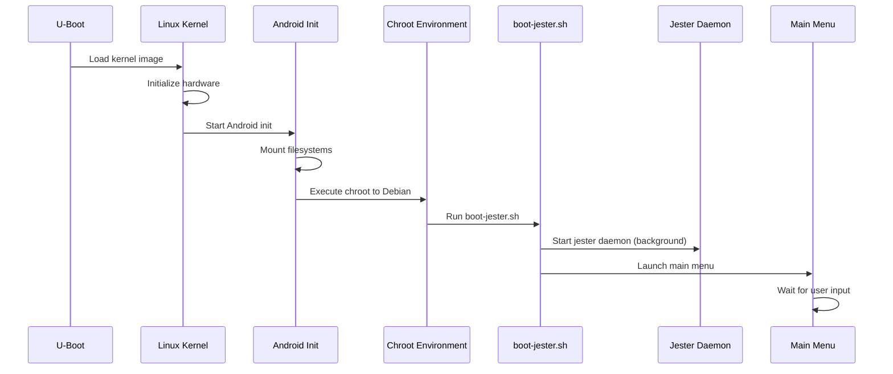

# Component Interaction Design

## Core Component Interactions

### 1. Boot Sequence Interactions



### 2. Writing Mode Interactions

```
User Input Flow:
┌──────────┐     ┌────────────┐     ┌─────────────┐
│   User   │────▶│  USB HID   │────▶│   Kernel    │
│ Keyboard │     │   Driver   │     │  Input      │
└──────────┘     └────────────┘     │  Subsystem  │
                                     └──────┬──────┘
                                            │
                                            ▼
┌──────────────────────────────────────────┴──────┐
│                    Input Router                  │
└──────────────────────┬───────────────────────────┘
                       │
        ┌──────────────┼──────────────┐
        ▼              ▼              ▼
┌──────────────┐ ┌──────────┐ ┌──────────────┐
│  Menu System │ │    Vim    │ │ QuillKernel  │
│              │ │           │ │  Typewriter  │
│  (menu       │ │ (editing) │ │  (stats)     │
│   choices)   │ │           │ │              │
└──────────────┘ └──────────┘ └──────────────┘
```

### 3. Display Update Pipeline

```
Display Update Flow:
┌──────────────┐
│ Application  │
│   Output     │
└──────┬───────┘
       │ Text/Graphics
       ▼
┌──────────────┐      ┌──────────────┐
│  common.sh   │◀────▶│   Buffer     │
│  display()   │      │  Manager     │
└──────┬───────┘      └──────────────┘
       │ Optimized Updates
       ▼
┌──────────────┐      ┌──────────────┐
│    FBInk     │◀────▶│  Refresh     │
│              │      │  Strategy    │
└──────┬───────┘      └──────────────┘
       │ Framebuffer Commands
       ▼
┌──────────────┐
│  /dev/fb0    │
│ Framebuffer  │
└──────┬───────┘
       │ Pixel Data
       ▼
┌──────────────┐
│  E-Ink       │
│  Display     │
└──────────────┘

Refresh Strategy Decision Tree:
- Full Refresh: Mode changes, menu switches
- Partial Update: Typing, cursor movement
- No Refresh: Identical content
```

### 4. Jester Daemon Interactions

```
Jester System:
┌─────────────────────────────────────────────────┐
│                Jester Daemon                    │
│                                                 │
│  ┌──────────┐  ┌──────────┐  ┌──────────────┐ │
│  │  State   │  │  ASCII   │  │   Wisdom     │ │
│  │  Manager │  │   Art    │  │  Generator   │ │
│  └─────┬────┘  └─────┬────┘  └──────┬───────┘ │
└────────┼─────────────┼──────────────┼─────────┘
         │             │              │
         ▼             ▼              ▼
┌─────────────────────────────────────────────────┐
│               /var/lib/jester/                  │
├─────────────────────────────────────────────────┤
│  state   │  ascii   │  wisdom  │  achievements  │
└─────────────────────────────────────────────────┘
         │             │              │
         ▼             ▼              ▼
┌─────────────────────────────────────────────────┐
│            /proc/squireos/ (if loaded)          │
├─────────────────────────────────────────────────┤
│  jester  │  typewriter/stats  │  wisdom         │
└─────────────────────────────────────────────────┘
```

### 5. File System Interactions

```
File Operations:
┌──────────────┐     ┌──────────────┐
│     Vim      │────▶│  File Save   │
└──────────────┘     └──────┬───────┘
                            │
                            ▼
                    ┌──────────────┐
                    │ Path Validator│
                    │  (common.sh)  │
                    └──────┬───────┘
                            │
                ┌───────────┼───────────┐
                ▼           ▼           ▼
        ┌──────────┐ ┌──────────┐ ┌──────────┐
        │  Notes   │ │  Drafts  │ │ Scrolls  │
        │   Dir    │ │   Dir    │ │   Dir    │
        └──────────┘ └──────────┘ └──────────┘
                │           │           │
                └───────────┼───────────┘
                            ▼
                    ┌──────────────┐
                    │   SD Card    │
                    │  Filesystem  │
                    └──────────────┘
```

### 6. Health Monitoring Interactions

```
Health Check System:
┌─────────────────────────────────────────────────┐
│            health-check.sh                      │
└──────────────────┬──────────────────────────────┘
                   │
    ┌──────────────┼──────────────┬───────────────┐
    ▼              ▼              ▼               ▼
┌────────┐    ┌────────┐    ┌────────┐     ┌────────┐
│ Memory │    │  CPU   │    │Storage │     │Battery │
│ Check  │    │ Check  │    │ Check  │     │ Check  │
└───┬────┘    └───┬────┘    └───┬────┘     └───┬────┘
    │             │              │              │
    ▼             ▼              ▼              ▼
┌─────────────────────────────────────────────────┐
│               System Metrics                    │
│  /proc/meminfo  │ /proc/stat │ df │ battery    │
└─────────────────────────────────────────────────┘
    │             │              │              │
    └──────────────┬─────────────┘              │
                   ▼                            ▼
            ┌──────────────┐           ┌──────────────┐
            │   Alerts     │           │   Logging    │
            │  (display)   │           │(/var/log/)   │
            └──────────────┘           └──────────────┘
```

### 7. Plugin System Interactions

```
Plugin Architecture:
┌─────────────────────────────────────────────────┐
│           nook-menu-plugin.sh                   │
└──────────────────┬──────────────────────────────┘
                   │
                   ▼
┌─────────────────────────────────────────────────┐
│         Plugin Discovery & Registration         │
│           /usr/local/bin/plugins/               │
└──────────────────┬──────────────────────────────┘
                   │
    ┌──────────────┼──────────────┬───────────────┐
    ▼              ▼              ▼               ▼
┌────────┐    ┌────────┐    ┌────────┐     ┌────────┐
│Plugin 1│    │Plugin 2│    │Plugin 3│     │Plugin N│
│        │    │        │    │        │     │        │
│validate│    │validate│    │validate│     │validate│
│execute │    │execute │    │execute │     │execute │
└────────┘    └────────┘    └────────┘     └────────┘
    │             │              │              │
    └──────────────┬─────────────┘              │
                   ▼                            ▼
            ┌──────────────┐           ┌──────────────┐
            │   Plugin     │           │   Plugin     │
            │   Output     │           │    State     │
            └──────────────┘           └──────────────┘
```

### 8. QuillKernel Module Interactions

```
Kernel Module Communication:
┌─────────────────────────────────────────────────┐
│              User Space Applications            │
└──────────────────┬──────────────────────────────┘
                   │ read()/write()
                   ▼
┌─────────────────────────────────────────────────┐
│                  procfs Interface               │
│              /proc/squireos/                    │
└──────────────────┬──────────────────────────────┘
                   │
    ┌──────────────┼──────────────┬───────────────┐
    ▼              ▼              ▼               ▼
┌────────────┐ ┌────────────┐ ┌────────────┐ ┌────────────┐
│squireos_   │ │jester.ko   │ │typewriter  │ │wisdom.ko   │
│core.ko     │ │            │ │.ko         │ │            │
│            │ │            │ │            │ │            │
│Creates root│ │ASCII art   │ │Statistics  │ │Quotes      │
└────────────┘ └────────────┘ └────────────┘ └────────────┘
       │              │              │              │
       └──────────────┼──────────────┘              │
                      ▼                            ▼
              ┌──────────────┐           ┌──────────────┐
              │Shared Memory │           │ Kernel Stats │
              │   Regions    │           │              │
              └──────────────┘           └──────────────┘
```

## Critical Interaction Patterns

### 1. Mode Switching Pattern
```
Menu → Mode Selection → Clear Display → Load Config → Enter Mode
     ↑                                                      │
     └──────────────── Exit Command ←──────────────────────┘
```

### 2. Writing Session Pattern
```
Start → Load Last File → Edit Loop → Auto-save → Statistics Update
                             ↑            │              │
                             └────────────┘              ▼
                                                   Achievement Check
```

### 3. Error Recovery Pattern
```
Error Detected → Log Error → Display User Message → Fallback Action
                      │                                    │
                      └────────────────────────────────────┘
                                   Recovery Loop
```

## Performance-Critical Paths

### Hot Paths (Optimize These)
1. **Keystroke → Display**: Must be <50ms
2. **Menu Navigation**: Must be <100ms
3. **File Save**: Must be <500ms
4. **Mode Switch**: Must be <1s

### Cold Paths (Can Be Slower)
1. **Boot Sequence**: Target <10s
2. **Plugin Load**: Can be 1-2s
3. **Statistics Update**: Can be async
4. **Achievement Check**: Can be batched

## Data Flow Patterns

### 1. Configuration Flow
```
/etc/nook.conf → common.sh → Environment Variables → Components
                     ↓
              Validation Layer
```

### 2. Statistics Flow
```
Keystrokes → Typewriter Module → /proc/squireos/typewriter/stats
                                            ↓
                                    Display/Achievement System
```

### 3. Display Update Flow
```
Application → Buffer → Batch Processor → FBInk → E-Ink
                ↑                           ↓
            Optimization ←──── Refresh Strategy
```

## Security Boundaries

### Trust Boundaries
```
┌─────────────────────────────────────────────────┐
│              Untrusted Input                    │
│         (USB Keyboard, File Names)              │
└──────────────────┬──────────────────────────────┘
                   │ Validation Layer
                   ▼
┌─────────────────────────────────────────────────┐
│           Trusted Processing Zone               │
│    (Validated input, Path checking)             │
└──────────────────┬──────────────────────────────┘
                   │ Safe Operations
                   ▼
┌─────────────────────────────────────────────────┐
│           Protected Resources                   │
│      (File system, Kernel modules)              │
└─────────────────────────────────────────────────┘
```

## Component Dependencies

### Startup Dependencies
```
squireos_core.ko → other kernel modules
common.sh → all shell scripts
FBInk → display operations
boot-jester.sh → menu system
```

### Runtime Dependencies
```
vim → file system operations
menu → display abstraction
jester → /var/lib/jester directory
health-check → /proc filesystem
```

## State Management

### Global State Locations
- `/var/lib/jester/state` - Jester mood/state
- `/proc/squireos/*` - Kernel module state
- Environment variables - Configuration state
- `/var/log/squireos.log` - System state log

### State Synchronization
- Jester state: File-based locking
- Writing stats: Kernel-managed atomicity
- Display state: FBInk internal
- Menu state: Process memory only

---

*"Components in harmony, like a well-rehearsed medieval court"* 🎭📜