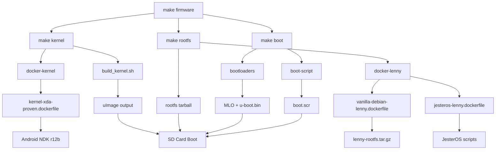

# JesterOS Build System Index

## 🏗️ Build Architecture Overview

### Build Components & Their Roles

```
┌─────────────────────────────────────────────────────────────┐
│                    JesterOS Build System                      │
├───────────────┬──────────────┬──────────────┬───────────────┤
│  KERNEL BUILD │ ROOTFS BUILD │  SD DEPLOY   │   TESTING     │
├───────────────┼──────────────┼──────────────┼───────────────┤
│ Linux 2.6.29  │ Debian Lenny │ Partitioning │ Integration   │
│ Android NDK   │ JesterOS     │ Boot files   │ Hardware      │
│ Cross-compile │ Scripts      │ Deployment   │ Validation    │
└───────────────┴──────────────┴──────────────┴───────────────┘
```

## 📁 Directory Structure

### `/build/` - Build Infrastructure
```
build/
├── docker/                      # Docker build environments
│   ├── vanilla-debian-lenny.dockerfile    # Base Debian 5.0 (2009)
│   ├── jesteros-lenny.dockerfile         # JesterOS on Lenny
│   ├── kernel-xda-proven.dockerfile      # Kernel build env
│   ├── modern-packager.dockerfile        # SD card tools
│   └── README.md                         # Docker documentation
├── scripts/                     # Build automation
│   ├── build_kernel.sh         # Main kernel build script
│   ├── setup-kernel-source.sh  # Kernel source management
│   ├── .kernel.env            # Build configuration
│   └── extract-bootloaders.sh # Bootloader extraction
└── configs/                    # Build configurations
    └── kernel/                 # Kernel configs
```

### `/source/` - Source Code
```
source/
├── kernel/                     # Linux 2.6.29 kernel
│   ├── src/                   # Kernel source tree
│   │   └── arch/arm/boot/     # ARM boot code
│   └── jesteros/              # (Legacy, now userspace)
├── configs/                   # System configurations
└── scripts/                   # (Moved to runtime/)
```

### `/runtime/` - JesterOS Runtime Scripts
```
runtime/
├── 1-ui/                      # User Interface Layer
│   ├── menu/                  # Menu systems
│   ├── themes/                # ASCII art & jesters
│   └── setup/                 # UI initialization
├── 2-application/             # Application Layer
│   ├── jesteros/             # Core JesterOS services
│   └── typewriter/           # Writing statistics
├── 3-system/                  # System Services Layer
│   ├── services/             # USB, boot, etc.
│   ├── common/               # Shared libraries
│   └── kernel/               # Kernel interfaces
└── 4-hardware/               # Hardware Layer
    ├── input/                # Button & keyboard
    └── display/              # E-Ink control
```

### `/tests/` - Test Infrastructure
```
tests/
├── test-runner.sh            # Main test orchestrator
├── run-tests.sh             # Test pipeline runner
├── 01-safety-check.sh       # Critical safety tests
├── 02-boot-test.sh          # Boot validation
├── 03-functionality.sh      # Feature tests
├── 04-docker-smoke.sh       # Docker validation
├── 05-consistency-check.sh  # Code consistency
├── 06-memory-guard.sh       # Memory limits
├── 07-writer-experience.sh  # UX testing
└── *.dockerfile             # Test environments
```

## 🔧 Build Processes

### 1. Kernel Build Process
**Command**: `make kernel` or `make docker-kernel`

**Steps**:
1. Build Docker image with Android NDK (`kernel-xda-proven.dockerfile`)
2. Download kernel source from catdotbashrc/nst-kernel
3. Configure for Nook (omap3621_gossamer_evt1c_defconfig)
4. Cross-compile with arm-linux-androideabi
5. Output: `source/kernel/src/arch/arm/boot/uImage`

**Dependencies**:
- Docker
- Internet (for NDK download ~400MB)
- ~4GB disk space

### 2. Rootfs Build Process
**Command**: `make docker-lenny` then `make lenny-rootfs`

**Steps**:
1. Build Debian Lenny base (`vanilla-debian-lenny.dockerfile`)
   - Requires: `lenny-rootfs.tar.gz` (14MB)
2. Build JesterOS on Lenny (`jesteros-lenny.dockerfile`)
3. Export rootfs: `jesteros-lenny-rootfs-*.tar.gz`

**Output Size**: ~14-59MB compressed

### 3. SD Card Deployment
**Command**: `./deploy-to-sd.sh /dev/sdX`

**Steps**:
1. Partition SD card (sector 63 alignment)
   - Partition 1: 256MB FAT32 (boot)
   - Partition 2: Remaining ext4 (root)
2. Copy boot files:
   - MLO (first, must be contiguous)
   - u-boot.bin
   - uImage (kernel)
3. Extract rootfs to partition 2

**Critical**: Use `sfdisk` with sector 63 for Nook compatibility

## 📊 Build Dependencies & Flow



## 🎯 Make Targets Reference

### Primary Targets
- `make firmware` - Complete build (kernel + rootfs + boot)
- `make kernel` - Build kernel only
- `make rootfs` - Build root filesystem
- `make lenny-rootfs` - Create Lenny-based rootfs
- `make image` - Create SD card image
- `make release` - Create release package

### Docker Targets
- `make docker-build` - Build all Docker images
- `make docker-lenny` - Build Lenny images
- `make docker-kernel` - Build kernel environment

### Testing Targets
- `make test` - Complete test pipeline
- `make test-quick` - Critical tests only
- `make test-safety` - Safety checks only

### Deployment Targets
- `make sd-deploy` - Build and deploy to SD
- `make quick-deploy` - Deploy kernel only
- `make detect-sd` - Find SD card devices

### Utility Targets
- `make clean` - Clean artifacts (preserves bootloaders)
- `make distclean` - Deep clean including Docker
- `make build-status` - Show current build state
- `make validate` - Validate environment

## 🔐 Key Files & Artifacts

### Essential Build Files
- `/lenny-rootfs.tar.gz` - Base Debian Lenny archive (14MB)
- `/firmware/boot/MLO` - First-stage bootloader
- `/firmware/boot/u-boot.bin` - Second-stage bootloader
- `/firmware/boot/uImage` - Compiled kernel

### Generated Artifacts
- `jesteros-lenny-rootfs-*.tar.gz` - Complete rootfs
- `nook-typewriter-*.img` - SD card image
- `build.log` - Build history

### Configuration Files
- `build/scripts/.kernel.env` - Kernel build config
- `nook-partitions.txt` - SD card partition layout

## ⚠️ Critical Notes

### Debian Version Requirement
- **MUST use Debian Lenny 5.0** (2009)
- Kernel 2.6.29 requires glibc 2.7
- Modern Debian (11+) is incompatible

### SD Card Alignment
- **MUST use sector 63** alignment
- Modern tools default to 2048 (won't boot)
- Use `sfdisk` with partition file

### Memory Constraints
- Total RAM: 233MB
- Available: ~35MB after Android base
- Lenny rootfs: ~59MB uncompressed
- Keep services minimal

### Docker Image Sizes
- `debian:lenny`: ~58MB
- `jesteros-lenny`: ~59MB
- `kernel-xda-proven`: ~2GB (with NDK)

## 📚 Related Documentation

- [CLAUDE.md](../../CLAUDE.md) - AI assistant guidelines
- [PROJECT_INDEX_2024.md](../../PROJECT_INDEX_2024.md) - Project overview
- [BOOT_ROADMAP.md](../../BOOT_ROADMAP.md) - Boot process details
- [build/docker/README.md](../../build/docker/README.md) - Docker specifics
- [docs/07-deployment/SUCCESSFUL_SD_DEPLOYMENT_GUIDE.md](../07-deployment/SUCCESSFUL_SD_DEPLOYMENT_GUIDE.md) - Deployment guide

## 🚀 Quick Start Commands

```bash
# Complete build and deploy
make firmware
make lenny-rootfs
./deploy-to-sd.sh /dev/sdg

# Kernel only update
make kernel
make quick-deploy SD_DEVICE=/dev/sdg

# Test before deploy
make test-quick
make sd-deploy SD_DEVICE=/dev/sdg
```

---

*Last Updated: August 2024*
*JesterOS - Transform a $20 e-reader into a distraction-free typewriter*