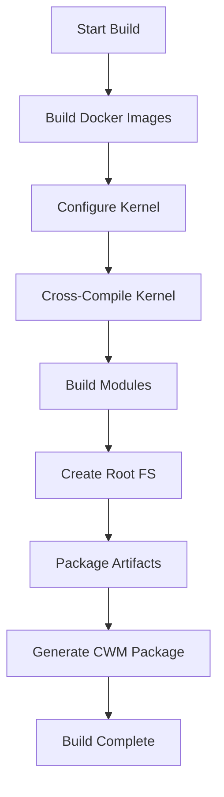

# 🔨 Nook Typewriter Build System Documentation

*Generated: December 13, 2024*

## Overview

The Nook Typewriter project uses a Docker-based build system for consistent cross-compilation of the JoKernel (Linux 2.6.29) and creation of optimized root filesystems for the Barnes & Noble Nook Simple Touch e-reader.

---

## 📊 Build System Architecture

### Key Components

| Component | Purpose | Output |
|-----------|---------|--------|
| **Docker Environments** | Isolated build environments | Container images |
| **Build Scripts** | Orchestrate compilation | Kernel, modules, rootfs |
| **Cross-Compiler** | ARM target compilation | ARM binaries |
| **Package System** | Deployment artifacts | .tar.gz, .zip files |

### Build Targets

1. **Kernel** - JoKernel with JesterOS modules
2. **Root Filesystem** - Minimal Linux environment
3. **Boot Package** - SD card boot files
4. **CWM Package** - ClockworkMod recovery installer

---

## 🐳 Docker Build Environments

### 1. **Kernel Builder** (`kernel-xda-proven.dockerfile`)

**Purpose**: Cross-compilation environment for kernel building

**Base Image**: Ubuntu 20.04 (proven stable for Android NDK)

**Toolchain**: 
- Android NDK r10e (XDA community proven)
- Cross-compiler: `arm-linux-androideabi-`
- Target: ARM Cortex-A8 (OMAP3621)

**Key Features**:
```dockerfile
# Install Android NDK
RUN wget android-ndk-r10e-linux-x86_64.bin
RUN ./android-ndk-r10e-linux-x86_64.bin

# Setup cross-compilation
ENV PATH="/opt/android-ndk/toolchains/arm-linux-androideabi-4.9/prebuilt/linux-x86_64/bin:$PATH"
ENV ARCH=arm
ENV CROSS_COMPILE=arm-linux-androideabi-
```

**Build Command**:
```bash
docker build -t jokernel-unified -f build/docker/kernel-xda-proven.dockerfile .
```

### 2. **Minimal Boot Environment** (`minimal-boot.dockerfile`)

**Purpose**: Ultra-lightweight root filesystem for MVP testing

**Base Image**: Debian Bullseye Slim

**Target Size**: <30MB compressed

**Components**:
- BusyBox for core utilities
- kmod for module loading
- Minimal init script
- MVP menu system

**Init Script Features**:
```bash
# Mount essential filesystems
mount -t proc none /proc
mount -t sysfs none /sys
mount -t devtmpfs none /dev

# Load JesterOS modules
insmod /lib/modules/jesteros_core.ko
insmod /lib/modules/jester.ko
insmod /lib/modules/typewriter.ko
insmod /lib/modules/wisdom.ko

# Show jester and launch menu
cat /proc/jesteros/jester
exec /usr/local/bin/mvp-menu.sh
```

### 3. **Optimized Writer Environment** (`nookwriter-optimized.dockerfile`)

**Purpose**: Production writing environment with Vim

**Build Modes**:
- **minimal**: No plugins, 2MB RAM usage
- **writer**: Goyo + Pencil plugins, 5MB RAM usage

**Key Packages**:
- Vim editor
- FBInk for E-Ink display
- Essential writing plugins
- BusyBox utilities

**Build Arguments**:
```bash
# Minimal build
docker build --build-arg BUILD_MODE=minimal -t nook-writer-minimal .

# Writer build (default)
docker build --build-arg BUILD_MODE=writer -t nook-writer .
```

**Memory Optimization**:
```dockerfile
# Remove unnecessary files
RUN rm -rf /var/lib/apt/lists/*
RUN rm -rf /usr/share/doc/*
RUN rm -rf /usr/share/man/*
RUN find / -name "*.a" -delete
```

### 4. **Root Filesystem Builder** (`rootfs.dockerfile`)

**Purpose**: Complete Debian-based root filesystem

**Features**:
- Full shell environment
- System utilities
- Network tools (disabled by default)
- Development headers (optional)

---

## 📜 Build Scripts

### Master Build Script (`build-all.sh`)

**Purpose**: Orchestrate complete firmware build

**Execution Flow**:
```bash
1. ./build/scripts/build-kernel.sh     # Build kernel
2. ./build/scripts/build-rootfs.sh      # Build root filesystem
3. ./build/scripts/create-boot.sh       # Create boot files
4. Package results in firmware/
```

### Kernel Build Script (`build_kernel.sh`)

**Purpose**: Build JoKernel with JesterOS modules

**Process**:
1. Check/build Docker image
2. Configure kernel for Nook hardware
3. Enable JesterOS modules in config
4. Cross-compile kernel to uImage
5. Build kernel modules
6. Copy artifacts to `firmware/boot/`

**Configuration Applied**:
```bash
make ARCH=arm omap3621_gossamer_evt1c_defconfig
echo 'CONFIG_JESTEROS=m' >> .config
echo 'CONFIG_JESTEROS_JESTER=y' >> .config
echo 'CONFIG_JESTEROS_TYPEWRITER=y' >> .config
echo 'CONFIG_JESTEROS_WISDOM=y' >> .config
```

**Output**:
- Kernel: `firmware/boot/uImage` (~1.9MB)
- Modules: `firmware/lib/modules/*.ko`

### Module Build Script (`build_modules.sh`)

**Purpose**: Compile JesterOS kernel modules

**Modules Built**:
1. `jesteros_core.ko` - Base module
2. `jester.ko` - ASCII art companion
3. `typewriter.ko` - Writing statistics
4. `wisdom.ko` - Quote system

**Build Command**:
```bash
make -j4 ARCH=arm CROSS_COMPILE=arm-linux-androideabi- modules
```

### CWM Package Creator (`create_cwm.sh`)

**Purpose**: Create ClockworkMod recovery installer

**Package Structure**:
```
squireos-cwm-install.zip
├── META-INF/
│   └── com/google/android/
│       └── update-script
├── boot/
│   └── uImage
└── system/
    └── lib/modules/
```

**Installation Script**:
```bash
# CWM update-script
ui_print("Installing JesterOS...");
package_extract_dir("boot", "/boot");
package_extract_dir("system", "/system");
set_perm_recursive(0, 0, 0755, 0644, "/system/lib/modules");
ui_print("Installation complete!");
```

### Deployment Script (`deploy_to_nook.sh`)

**Purpose**: Deploy to SD card or device

**Safety Features**:
- Device detection
- Partition verification
- Backup existing data
- Safe unmount

---

## 🏗️ Build Process

### Complete Build Workflow



### Step-by-Step Build

#### 1. **Environment Setup**
```bash
# Clone repository
git clone --recursive https://github.com/yourusername/nook-typewriter.git
cd nook-typewriter

# Initialize submodules
git submodule update --init --recursive
```

#### 2. **Build Kernel**
```bash
# Simple one-command build
./build_kernel.sh

# Or manually with Docker
docker run --rm \
    -v $(pwd)/source/kernel:/kernel \
    jokernel-unified \
    make -j4 ARCH=arm CROSS_COMPILE=arm-linux-androideabi- uImage
```

#### 3. **Build Root Filesystem**
```bash
# Minimal boot environment
docker build -t nook-mvp-rootfs -f build/docker/minimal-boot.dockerfile .

# Full writer environment
docker build -t nook-writer -f build/docker/nookwriter-optimized.dockerfile .
```

#### 4. **Package for Deployment**
```bash
# Create deployment package
docker create --name nook-export nook-writer
docker export nook-export | gzip > nook-writer.tar.gz
docker rm nook-export

# Create CWM package
./build/scripts/create_cwm.sh
```

---

## 📦 Build Outputs

### Directory Structure
```
build/output/
├── squireos-nook-1.0.0.tar.gz      # Complete firmware package
├── squireos-modules-[date].tar.gz   # Kernel modules only
├── squireos-cwm-install.zip         # CWM installer
└── build.log                         # Build log
```

### Artifact Details

| Artifact | Size | Contents |
|----------|------|----------|
| `uImage` | ~1.9MB | Compressed kernel image |
| `*.ko modules` | ~200KB | JesterOS kernel modules |
| `rootfs.tar.gz` | ~30MB | Minimal root filesystem |
| `cwm-install.zip` | ~32MB | Complete CWM package |

---

## 🔧 Build Configuration

### Kernel Configuration

**Config File**: `omap3621_gossamer_evt1c_defconfig`

**Key Settings**:
```kconfig
CONFIG_ARCH_OMAP3=y
CONFIG_MACH_OMAP3621_GOSSAMER=y
CONFIG_ARM_THUMB=y
CONFIG_AEABI=y
CONFIG_JESTEROS=m
CONFIG_JESTEROS_JESTER=y
CONFIG_JESTEROS_TYPEWRITER=y
CONFIG_JESTEROS_WISDOM=y
```

### Memory Configuration

**Constraints**:
- Total RAM: 256MB
- OS Maximum: 96MB
- Reserved for Writing: 160MB

**Kernel Parameters**:
```
mem=96M
```

### Cross-Compilation Settings

**Environment Variables**:
```bash
export ARCH=arm
export CROSS_COMPILE=arm-linux-androideabi-
export KERNEL_DIR=/kernel/src
export MODULE_DIR=/lib/modules/2.6.29
```

---

## 🚀 Quick Build Commands

### One-Line Builds
```bash
# Build everything
make all

# Build kernel only
./build_kernel.sh

# Build minimal rootfs
docker build -t nook-mvp -f build/docker/minimal-boot.dockerfile .

# Build writer environment
docker build -t nook-writer -f build/docker/nookwriter-optimized.dockerfile .

# Clean build
make clean && make all
```

### Docker Commands
```bash
# List build images
docker images | grep nook

# Run build container interactively
docker run -it --rm jokernel-unified bash

# Export rootfs
docker export $(docker create nook-writer) | gzip > rootfs.tar.gz
```

---

## 🐛 Troubleshooting

### Common Build Issues

#### Issue: Docker build fails
**Solution**: 
```bash
# Clean Docker cache
docker system prune -a
# Rebuild with no cache
docker build --no-cache -t jokernel-unified .
```

#### Issue: Kernel compilation error
**Solution**:
```bash
# Clean kernel build
cd source/kernel/src
make clean
make mrproper
# Retry build
```

#### Issue: Module loading fails
**Solution**:
- Verify module path: `/lib/modules/2.6.29/`
- Check kernel version match
- Review dmesg for errors

#### Issue: Out of memory during build
**Solution**:
```bash
# Increase Docker memory
docker run --memory="4g" --memory-swap="4g" ...
# Or reduce parallel jobs
make -j2 instead of make -j4
```

---

## 📈 Build Performance

### Typical Build Times

| Component | Time | CPU Usage |
|-----------|------|-----------|
| Docker Image | 5 min | Low |
| Kernel Compile | 10 min | High |
| Module Build | 2 min | Medium |
| RootFS Creation | 3 min | Low |
| Total | ~20 min | Variable |

### Resource Requirements

- **Disk Space**: 10GB free
- **RAM**: 4GB minimum
- **CPU**: 2+ cores recommended
- **Network**: For Docker pulls

---

## 🔐 Build Security

### Verification Steps
1. Verify toolchain checksums
2. Check kernel signature
3. Validate module signing
4. Review build logs

### Reproducible Builds
- Fixed Docker base images
- Specific toolchain versions
- Deterministic build flags
- Version-controlled configs

---

## 📚 Related Documentation

- [Kernel Configuration Guide](KERNEL_CONFIG.md)
- [Docker Environment Details](DOCKER_SETUP.md)
- [Cross-Compilation Guide](CROSS_COMPILE.md)
- [Deployment Guide](DEPLOYMENT.md)

---

*"Build with jest, deploy with confidence!"* 🎭

**Version**: 1.0.0  
**Last Updated**: December 13, 2024  
**Build System**: Docker + Make