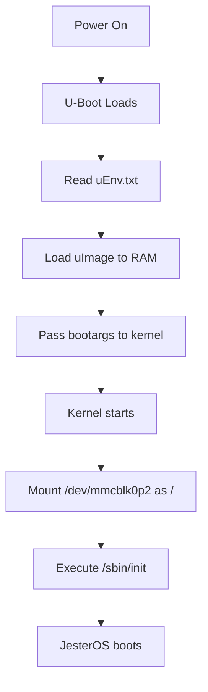

# Nook Device Naming and Boot Process

## Understanding Linux Device Names on the Nook

This document explains how the Nook Simple Touch identifies and uses storage devices during boot, a critical concept for building and deploying custom firmware.

## Device Naming Convention

### MMC Block Devices on ARM

The Nook uses ARM-specific device naming for SD/MMC cards:

```
/dev/mmcblk0p2
│    │      │ └─> Partition number (p2 = partition 2)
│    │      └───> Partition separator (p)
│    └──────────> Card number (0 = first card)
└───────────────> MMC block device type
```

### Hardware Storage Layout

The Nook Simple Touch has two MMC controllers:

| Controller | Device Path | Description | Usage |
|------------|------------|-------------|--------|
| MMC 0 | `/dev/mmcblk0` | External SD slot | Your custom OS |
| MMC 1 | `/dev/mmcblk1` | Internal NAND | Stock Android |

## Boot Device Selection

### Physical Storage Mapping

```
┌─────────────────────────────────────┐
│         Nook Hardware               │
├─────────────────────────────────────┤
│ External SD Card (mmcblk0)          │
│ ├─ mmcblk0p1: Boot (FAT32, 256MB)   │
│ │   ├─ MLO (first stage loader)     │
│ │   ├─ u-boot.bin (bootloader)      │
│ │   ├─ uImage (kernel)              │
│ │   └─ uEnv.txt (boot config)       │
│ └─ mmcblk0p2: Root (ext4, 1.8GB)    │
│     └─ Linux filesystem             │
├─────────────────────────────────────┤
│ Internal NAND (mmcblk1)             │
│ ├─ mmcblk1p1: Boot                  │
│ ├─ mmcblk1p2: System                │
│ └─ mmcblk1p3: Data                  │
└─────────────────────────────────────┘
```

## Boot Process Flow

### 1. Hardware Initialization
- CPU starts and looks for bootloader
- Checks SD card slot first (mmcblk0)
- Falls back to internal NAND (mmcblk1) if no SD

### 2. U-Boot Reads Configuration

The bootloader reads `uEnv.txt` which contains:

```bash
bootargs=console=ttyS0,115200n8 root=/dev/mmcblk0p2 rootfstype=ext4 rootwait rw init=/sbin/init
```

#### Breaking Down Boot Arguments

| Parameter | Value | Purpose |
|-----------|-------|---------|
| `console` | `ttyS0,115200n8` | Serial console for debugging |
| `root` | `/dev/mmcblk0p2` | Location of root filesystem |
| `rootfstype` | `ext4` | Filesystem type of root partition |
| `rootwait` | (flag) | Wait for SD card to be ready |
| `rw` | (flag) | Mount root as read-write |
| `init` | `/sbin/init` | First program to run |

### 3. Kernel Boot Sequence



## Critical Concepts

### Why mmcblk0p2 Specifically?

1. **mmcblk0**: Refers to the external SD card slot
2. **p2**: Second partition on that device
3. This tells the kernel exactly where to find the Linux filesystem

### Common Pitfalls

#### Wrong Device Path
```bash
# WRONG - These will cause boot failure:
root=/dev/sda2          # PC-style naming, doesn't exist on Nook
root=/dev/mmcblk1p2     # Points to internal Android storage
root=2                  # Ambiguous, kernel doesn't understand

# CORRECT:
root=/dev/mmcblk0p2     # External SD, partition 2
```

#### Device Name Differences

The same physical partition has different names depending on where you access it:

| System | Device Path | When Used |
|--------|------------|-----------|
| Your PC | `/dev/sde2` (or similar) | Writing image to SD |
| Nook | `/dev/mmcblk0p2` | During boot |

## Troubleshooting Boot Issues

### Symptom: Boots to Android Instead of Custom OS

**Cause**: Missing or incorrect `uEnv.txt`

**Solution**: Ensure uEnv.txt contains:
```bash
root=/dev/mmcblk0p2
```

### Symptom: Kernel Panic - No Root Filesystem

**Cause**: Wrong device path in bootargs

**Solution**: Verify using correct mmcblk device:
- `mmcblk0` for SD card
- NOT `mmcblk1` (internal storage)

### Symptom: Read-Only Filesystem

**Cause**: Missing `rw` flag in bootargs

**Solution**: Add `rw` to bootargs in uEnv.txt

## Build System Integration

When creating images with `make image`, the build system:

1. Creates two partitions on the image
2. Formats partition 1 as FAT32 (boot)
3. Formats partition 2 as ext4 (root)
4. Configures uEnv.txt to point to `/dev/mmcblk0p2`

This ensures the Nook will:
- Boot from the SD card (mmcblk0)
- Mount the correct root partition (p2)
- Start the JesterOS environment

## Testing Device Detection

To verify device detection on a running Nook:

```bash
# List all block devices
cat /proc/partitions

# Check current root device
mount | grep "on / "

# Verify SD card presence
ls -la /dev/mmcblk0*
```

## Related Documentation

- [Kernel Build Guide](kernel-build-guide.md) - Building the kernel
- [Root Filesystem Build](rootfs-build.md) - Creating the root partition
- [Build Architecture](build-architecture.md) - Overall build system

## Key Takeaways

1. **mmcblk0** = External SD card on Nook hardware
2. **mmcblk0p2** = Second partition (root filesystem)
3. Boot arguments in `uEnv.txt` tell kernel where to find root
4. Same physical device has different names on PC vs Nook
5. Incorrect device paths are the #1 cause of boot failures

---

*Last updated: August 2024*  
*Applies to: Nook Simple Touch (BNRV300)*