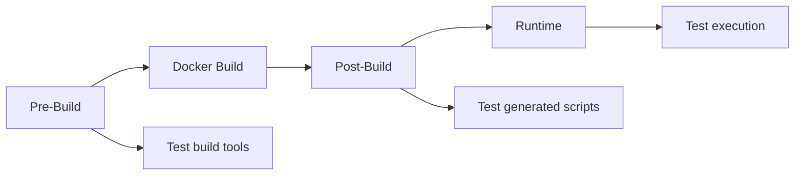

# 🧪 Developer Testing Guide

*Three-Stage Testing Architecture for Nook TypeWriter Development*

## 🎯 Three-Stage Testing Philosophy

Our testing follows a **three-stage pipeline** that validates different aspects of the build at the appropriate time:



### Stage Overview

| Stage | Target Directory | What's Tested | When to Run |
|-------|-----------------|---------------|-------------|
| **Pre-Build** | `scripts/` | Build tools, deployment scripts | Before Docker build |
| **Post-Build** | `source/scripts/` | Docker-generated runtime scripts | After Docker build |
| **Runtime** | Container | Actual execution behavior | After container starts |

---

## Quick Start Testing

### Complete Test Pipeline
```bash
# Run all three stages (recommended)
make test

# This runs:
# 1. make test-pre-build   (validate build tools)
# 2. make docker-build     (build Docker image)
# 3. make test-post-build  (validate Docker output)
# 4. make test-runtime     (validate execution)
```

### Individual Stage Testing
```bash
# Test build tools only
make test-pre-build

# Test Docker output (requires built image)
make test-post-build

# Test runtime execution
make test-runtime
```

### Environment Variable Control
```bash
# Manually specify test stage
TEST_STAGE=pre-build ./tests/run-tests.sh
TEST_STAGE=post-build ./tests/run-tests.sh
TEST_STAGE=runtime ./tests/run-tests.sh
```

---

## Test Categories (Hobby Robust™)

### 🛡️ Show Stoppers (MUST PASS)
**Critical safety checks - will it brick the device?**

| Test | File | Stages | Purpose |
|------|------|--------|---------|
| Safety Check | `01-safety-check.sh` | pre-build, post-build | Validates no dangerous commands |
| Boot Test | `02-boot-test.sh` | post-build, runtime | Ensures boot sequence works |

### 🚧 Writing Blockers (SHOULD PASS)
**Core functionality - can you write?**

| Test | File | Stages | Purpose |
|------|------|--------|---------|
| Docker Smoke | `04-docker-smoke.sh` | runtime | Container execution validation |
| Consistency | `05-consistency-check.sh` | post-build | Script references valid |
| Memory Guard | `06-memory-guard.sh` | post-build | Protects 160MB writing space |

### ✨ Writer Experience (NICE TO PASS)
**Polish and usability - is it pleasant?**

| Test | File | Stages | Purpose |
|------|------|--------|---------|
| Functionality | `03-functionality.sh` | post-build | Feature completeness |
| Writer UX | `07-writer-experience.sh` | post-build, runtime | Error handling quality |

---

## Development Workflows

### Before Making Changes
```bash
# 1. Verify your starting point
make test-pre-build  # Ensure build tools work

# 2. Make your changes to scripts/
vim scripts/deployment/create-sd-image.sh

# 3. Test your changes
make test-pre-build  # Verify changes don't break build
```

### After Docker Build
```bash
# 1. Build the Docker image
make docker-build

# 2. Validate generated scripts
make test-post-build  # Check source/scripts/ output

# 3. If issues found, fix in Dockerfile or build process
# (Never edit source/scripts/ directly - it's regenerated!)
```

### Before Deployment
```bash
# Complete validation pipeline
make test  # Runs all three stages

# Quick safety check only
TEST_STAGE=post-build ./tests/01-safety-check.sh
```

---

## Understanding Test Failures

### Pre-Build Stage Failures
**Location**: Problems in `scripts/` directory
**Fix**: Edit the script directly in `scripts/`

Example:
```bash
✗ Script not executable: scripts/deployment/create-sd-image.sh
→ Fix: chmod +x scripts/deployment/create-sd-image.sh
```

### Post-Build Stage Failures
**Location**: Problems in `source/scripts/` directory
**Fix**: Modify Dockerfile or build process (NOT source/scripts/)

Example:
```bash
✗ Found /proc/squireos references (should be /var/jesteros)
→ Fix: Update Dockerfile COPY or sed commands
→ Wrong: Edit source/scripts/boot/init.sh directly
```

### Runtime Stage Failures
**Location**: Execution problems in container
**Fix**: Debug with container logs, fix in source files

Example:
```bash
✗ Menu system doesn't display
→ Debug: docker run --rm nook-writer /bin/bash
→ Fix: Update menu script in appropriate source location
```

---

## Test Stage Details

### Pre-Build Stage
Tests the `scripts/` directory containing build and deployment tools:
- `apply_metadata.sh` - Metadata application
- `create-sd-image.sh` - SD card creation
- `secure-chmod-replacements.sh` - Security tools
- `version-control.sh` - Version management

### Post-Build Stage
Tests the `source/scripts/` directory containing runtime scripts:
- `boot/*.sh` - Boot sequence scripts
- `menu/*.sh` - Writing menu system
- `services/*.sh` - JesterOS services
- `lib/*.sh` - Common libraries

### Runtime Stage
Tests actual execution inside Docker container:
- Container boots successfully
- Menu system displays
- Vim launches properly
- JesterOS services start
- Writing workflow functions

---

## Advanced Testing

### Custom Test Stages
```bash
# Test with custom stage in your own scripts
#!/bin/bash
TEST_STAGE=${TEST_STAGE:-post-build}

case "$TEST_STAGE" in
    pre-build)
        TARGET_DIR="../scripts"
        ;;
    post-build)
        TARGET_DIR="../source/scripts"
        ;;
    runtime)
        TARGET_DIR="/source/scripts"
        ;;
esac

# Your test logic here
```

### Parallel Testing
```bash
# Run multiple stages in parallel (advanced)
make test-pre-build &
PID1=$!
make docker-build && make test-post-build &
PID2=$!
wait $PID1 $PID2
make test-runtime
```

### CI/CD Integration
```yaml
# Example GitHub Actions workflow
jobs:
  test:
    steps:
      - name: Pre-build tests
        run: make test-pre-build
      
      - name: Build Docker image
        run: make docker-build
      
      - name: Post-build tests
        run: make test-post-build
      
      - name: Runtime tests
        run: make test-runtime
```

---

## Testing Philosophy

### Why Three Stages?

1. **Separation of Concerns**: Build tools ≠ runtime scripts
2. **Clear Boundaries**: Know exactly what failed where
3. **Appropriate Fixes**: Edit the right files in the right place
4. **Progressive Validation**: Catch issues at the earliest stage

### Hobby Robust™ Principles

- **Simple**: Just one environment variable (`TEST_STAGE`)
- **Clear**: Explicit about what's being tested when
- **Fast**: ~30 seconds for critical tests
- **Focused**: Test what matters for writers, not enterprise metrics

### What We DON'T Test

- 90% code coverage (this is a hobby project!)
- Every edge case (perfect is the enemy of done)
- Performance microseconds (E-Ink is slow anyway)
- Security vulnerabilities (it's offline and single-user)

---

## Troubleshooting

### Common Issues

**"Directory source/scripts/ not found"**
- Run `make docker-build` first
- Post-build tests require Docker output

**"Tests pass individually but fail in pipeline"**
- Check for side effects between tests
- Ensure clean state between stages

**"Runtime tests fail but container works manually"**
- Check TEST_STAGE environment variable
- Verify Docker image is up-to-date

### Debug Commands

```bash
# See what stage is active
echo $TEST_STAGE

# Run with verbose output
TEST_STAGE=post-build bash -x ./tests/05-consistency-check.sh

# Check what's in each directory
ls -la scripts/
ls -la source/scripts/
docker run --rm nook-writer ls -la /source/scripts/
```

---

## Quick Reference Card

```bash
# Complete pipeline
make test

# Individual stages
make test-pre-build   # Before Docker build
make test-post-build  # After Docker build  
make test-runtime     # Container execution

# Manual control
TEST_STAGE=pre-build ./tests/run-tests.sh
TEST_STAGE=post-build ./tests/run-tests.sh
TEST_STAGE=runtime ./tests/run-tests.sh

# Quick checks
make test-safety      # Critical safety only
make test-quick       # Show stoppers only

# Where to fix issues
scripts/            → Fix directly (pre-build)
source/scripts/     → Fix in Dockerfile (post-build)
Container behavior  → Fix in source files (runtime)
```

---

*"Test enough to sleep well, not to pass an audit"* 🕯️📜