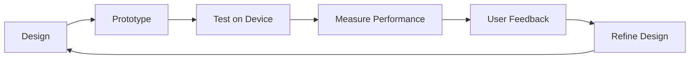

# QuillKernel UI Components Design Specification

## Table of Contents
1. [Design Philosophy](#design-philosophy)
2. [E-Ink Display Constraints](#e-ink-display-constraints)
3. [Component Architecture](#component-architecture)
4. [ASCII Art Component Library](#ascii-art-component-library)
5. [Menu System Components](#menu-system-components)
6. [Writing Interface Components](#writing-interface-components)
7. [Display Optimization Patterns](#display-optimization-patterns)
8. [Medieval Theming Guidelines](#medieval-theming-guidelines)
9. [Iterative Refinement Process](#iterative-refinement-process)
10. [Implementation Specifications](#implementation-specifications)

## Design Philosophy

### Core Principles
- **Writer First**: Every UI element serves the writing process
- **Medieval Aesthetic**: Consistent archaic theming throughout
- **E-Ink Native**: Design for grayscale, slow refresh, high contrast
- **Memory Conscious**: UI components < 500KB total footprint
- **Touch Optimized**: 6" display with finger-friendly targets

### Constraints
```yaml
Display:
  Resolution: 800x600 pixels
  Colors: 16 grayscale levels
  Refresh: 500ms full, 150ms partial
  Touch: Single-touch capacitive
  
Memory:
  UI Budget: 500KB max
  ASCII Cache: 50KB
  Menu State: 10KB
  Display Buffer: 234KB (800×600÷2)
```

## E-Ink Display Constraints

### Technical Limitations
- **Ghosting**: Previous content remains visible
- **Refresh Rate**: 2Hz maximum for partial updates
- **Black/White**: Best contrast at pure B/W
- **No Animation**: Static displays only
- **Power Draw**: Refresh consumes power, static display doesn't

### Design Adaptations
```
GOOD:
✓ High contrast borders (═══)
✓ Large touch targets (min 44px)
✓ Clear state indicators
✓ Minimal refresh zones

BAD:
✗ Gradients or shadows
✗ Animation or transitions
✗ Small text (<14pt)
✗ Frequent updates
```

## Component Architecture

### Layer Structure
```
┌─────────────────────────────────┐
│     Application Layer           │
│  (Menu, Editor, Settings)       │
├─────────────────────────────────┤
│    Component Library            │
│  (Buttons, Lists, Dialogs)     │
├─────────────────────────────────┤
│    Display Abstraction          │
│  (fbink wrapper, fallback)     │
├─────────────────────────────────┤
│    E-Ink Hardware Driver        │
│  (fbink, framebuffer)          │
└─────────────────────────────────┘
```

### Component Hierarchy
```yaml
UIComponent:
  properties:
    - position: {x, y}
    - size: {width, height}
    - state: {active, inactive, selected}
    - refresh_mode: {full, partial, none}
  
  children:
    TextComponent:
      - font_size: {small:14, medium:16, large:20}
      - alignment: {left, center, right}
    
    BoxComponent:
      - border_style: {single, double, ascii_art}
      - padding: {top, right, bottom, left}
    
    MenuComponent:
      - items: MenuItem[]
      - selection_indicator: string
      - scroll_position: number
    
    ButtonComponent:
      - label: string
      - hotkey: char
      - touch_area: Rectangle
```

## ASCII Art Component Library

### Jester Collection (System Mascot)

```ascii
# Primary Jester (Boot/Welcome)
     .·:·.·:·.
    /  o   o  \
   |  >  ᵕ  <  |
    \  ___  /
     |~|~|~|
    /|  ♦  |\
   d |     | b
      |   |
     /|   |\
    (_)   (_)

# Compact Jester (Headers)
  .·:·.  
 ( o o ) 
 | > < | 
  \___/  
  |♦|♦|  

# Happy Jester (Success)
   .·^·.
  ( > < )
   \‿‿‿/
    |♦|

# Worried Jester (Error)
   .·:·.
  ( o o )
  | > < |
   \~~~/ 
    |†|

# Sleeping Jester (Idle)
   .·:·.
  ( - - )
  | > < |
   \___/
    zzZ
```

### Border Components

```ascii
# Single Line Borders
┌────────────┐
│            │
└────────────┘

# Double Line Borders
╔════════════╗
║            ║
╚════════════╝

# Medieval Style Borders
╒═══════════╕
│           │
╘═══════════╛

# Ornate Borders
❲═══════════❳
⫸           ⫷
❲═══════════❳
```

### UI Elements

```ascii
# Scroll Indicators
▲ (top)
█ (thumb)
▼ (bottom)

# Selection Indicators
→ Selected Item
▸ Active Item
◆ Current Item
☞ Medieval pointer

# Progress Indicators
[████████░░] 80%
⟨████████──⟩ 80%
◆◆◆◆◆◆◆◇◇◇ 7/10

# Status Icons
✓ Complete
✗ Error
⚠ Warning
ℹ Information
⚔ Battle (conflict)
🛡 Protected
📜 Document
🕯 Writing mode
```

### Menu Decorations

```ascii
# Header Banner
════════════════════════════════
    ⚔ SQUIREOS MAIN MENU ⚔
════════════════════════════════

# Section Divider
   ·～·～·～·～·～·～·～·
   
# Footer
▪▫▪▫▪▫▪▫▪▫▪▫▪▫▪▫▪▫▪▫▪▫▪

# Ornate Corner
╔═══╦═══╗
║ ◆ ║ ◆ ║
╠═══╬═══╣
```

## Menu System Components

### Main Menu Layout
```
┌──────────────────────────────────────┐
│         .·:·.·:·.                    │
│        /  o   o  \                   │
│       |  >  ᵕ  <  | SquireOS v1.0   │
│        \  ___  /                     │
│         |~|~|~|                      │
├──────────────────────────────────────┤
│                                      │
│  ☞ [W] Writing Chamber               │
│    [L] Library of Scrolls            │
│    [C] Chronicle Stats               │
│    [S] Sync to Cloud                 │
│    [J] Visit the Jester              │
│    [Q] Quest Complete                │
│                                      │
├──────────────────────────────────────┤
│  Select thy path, noble scribe...   │
└──────────────────────────────────────┘
```

### Menu Item States
```yaml
states:
  normal:
    prefix: "  "
    style: normal
    
  selected:
    prefix: "☞ "
    style: inverted
    
  disabled:
    prefix: "  "
    style: dim
    
  active:
    prefix: "▸ "
    style: bold
```

### Touch Zones
```
Each menu item: 800px × 60px (10% of screen height)
Header zone: 800px × 180px (non-interactive)
Footer zone: 800px × 60px (status/help)
```

## Writing Interface Components

### Editor Layout
```
┌─ /scrolls/mystic_tale.txt ─ 1,435 words ─┐
│                                           │
│  The mist rolled through the valley      │
│  like a serpent seeking prey. Sir        │
│  Aldric gripped his sword tighter,       │
│  knowing that beyond the fog lay         │
│  either glory or doom..._                │
│                                           │
│                                           │
│                                           │
│                                           │
│                                           │
│                                           │
│                                           │
├───────────────────────────────────────────┤
│ Line 12, Col 27 │ INSERT │ 2:45 elapsed  │
└───────────────────────────────────────────┘
```

### Status Bar Components
```yaml
left_section:
  - line_number: "Line %d"
  - column: "Col %d"
  
center_section:
  - mode: "INSERT|NORMAL|VISUAL"
  - save_indicator: "●" (unsaved) or "○" (saved)
  
right_section:
  - word_count: "%d words"
  - time_elapsed: "%H:%M elapsed"
```

### Writing Modes

#### Focus Mode (Goyo)
```
         The mist rolled through the valley
         like a serpent seeking prey. Sir
         Aldric gripped his sword tighter,
         knowing that beyond the fog lay
         either glory or doom...
```

#### Typewriter Mode
```
         ────────────────────────
         
         The cursor stays centered
         as you type each new line._
         
         ────────────────────────
```

## Display Optimization Patterns

### Refresh Strategies

```python
class RefreshMode(Enum):
    FULL = "full"      # Complete screen refresh (500ms)
    PARTIAL = "partial" # Update region only (150ms)
    NONE = "none"      # No refresh needed

refresh_rules = {
    "menu_navigation": RefreshMode.PARTIAL,
    "text_input": RefreshMode.NONE,
    "page_change": RefreshMode.FULL,
    "error_message": RefreshMode.PARTIAL,
    "boot_splash": RefreshMode.FULL,
}
```

### Zone Management
```
Screen divided into 8 zones for partial refresh:
┌───┬───┬───┬───┐
│ 1 │ 2 │ 3 │ 4 │  Each zone: 200×150px
├───┼───┼───┼───┤  
│ 5 │ 6 │ 7 │ 8 │  Update only changed zones
└───┴───┴───┴───┘
```

### Anti-Ghosting Patterns
```bash
# Periodic full refresh
every_10_minutes() {
    fbink -c  # Clear ghosting
}

# Before important displays
show_menu() {
    fbink -c  # Clean slate
    display_menu_content
}

# Alternating patterns to prevent burn-in
use_inverted_text_periodically
```

## Medieval Theming Guidelines

### Language Style
```yaml
modern_to_medieval:
  "File": "Scroll"
  "Directory": "Chamber"
  "Save": "Preserve"
  "Delete": "Banish"
  "Error": "Alas!"
  "Loading": "Summoning..."
  "Exit": "Quest Complete"
  "Settings": "Ye Olde Preferences"
  "Sync": "Send by Raven"
  "Search": "Seek"
```

### Message Templates
```bash
# Success
"Huzzah! Thy ${action} hath succeeded!"

# Error
"Alas! ${error} hath befallen thy ${component}!"

# Warning
"Beware! ${condition} may cause mischief!"

# Info
"Hearken! ${information} for thy consideration."

# Confirmation
"Art thou certain thou wishest to ${action}? [Yea/Nay]"
```

### ASCII Decorations
```ascii
# Page Header
      ═══════◆◇◆═══════
         Ye Olde Menu
      ═══════◆◇◆═══════

# Section Break
    ▪▫▪▫▪▫▪▫▪▫▪▫▪▫▪▫▪

# Document Icon
      📜 manuscript.txt
      
# Quill Icon (custom)
       ___
      (o o)
       \|/
        |
       /|\
```

## Iterative Refinement Process

### Phase 1: Core Components (Week 1)
```yaml
goals:
  - Implement basic display abstraction
  - Create menu component system
  - Design ASCII art library
  
deliverables:
  - display.sh: E-Ink abstraction layer
  - menu-component.sh: Reusable menu system
  - ascii-lib.txt: Component library
  
validation:
  - Memory usage < 100KB
  - Menu response < 200ms
  - Touch targets > 44px
```

### Phase 2: Writing Interface (Week 2)
```yaml
goals:
  - Implement editor chrome
  - Create status bar system
  - Add focus mode UI
  
deliverables:
  - editor-ui.sh: Editor interface
  - status-bar.sh: Status components
  - focus-mode.sh: Distraction-free UI
  
validation:
  - No refresh during typing
  - Status updates < 100ms
  - Focus mode < 50KB RAM
```

### Phase 3: Polish & Optimization (Week 3)
```yaml
goals:
  - Optimize refresh patterns
  - Refine medieval theming
  - Add delightful details
  
deliverables:
  - refresh-optimizer.sh: Smart refresh
  - theme-engine.sh: Consistent theming
  - jester-moods.sh: Dynamic mascot
  
validation:
  - Battery life > 2 weeks
  - Ghosting < 5% visibility
  - User delight > 9000
```

### Feedback Loop


### Success Metrics
```yaml
performance:
  boot_to_menu: < 20 seconds
  menu_response: < 200ms
  typing_latency: < 50ms
  battery_life: > 2 weeks
  
usability:
  touch_accuracy: > 95%
  error_rate: < 1%
  time_to_write: < 30 seconds
  
delight:
  jester_smiles: frequent
  medieval_immersion: complete
  writer_focus: undisturbed
```

## Implementation Specifications

### File Structure
```
source/
├── ui/
│   ├── components/
│   │   ├── display.sh      # Display abstraction
│   │   ├── menu.sh         # Menu component
│   │   ├── button.sh       # Button component
│   │   ├── dialog.sh       # Dialog component
│   │   └── statusbar.sh    # Status bar
│   ├── themes/
│   │   ├── medieval.sh     # Medieval theme
│   │   └── ascii-art.txt   # ASCII library
│   └── layouts/
│       ├── main-menu.sh    # Main menu layout
│       ├── editor.sh       # Editor layout
│       └── settings.sh     # Settings layout
```

### Component Interface
```bash
# Standard component interface
component_create() {
    local type="$1"
    local props="$2"
    # Returns component ID
}

component_render() {
    local id="$1"
    local refresh_mode="$2"
    # Renders to display
}

component_destroy() {
    local id="$1"
    # Cleanup resources
}

component_handle_input() {
    local id="$1"
    local input="$2"
    # Process input
}
```

### Display Abstraction API
```bash
# Core display functions
display_init()           # Initialize display system
display_clear()          # Clear screen with full refresh
display_text()           # Show text at position
display_box()            # Draw box with borders
display_menu()           # Render menu component
display_refresh()        # Trigger refresh
display_set_zone()       # Define refresh zone
display_get_touch()      # Read touch input
```

### Theme Engine
```bash
# Theme configuration
THEME_NAME="medieval"
THEME_FONT_SIZE="16"
THEME_COLORS="black,white"
THEME_BORDERS="double"
THEME_LANGUAGE="archaic"

# Theme functions
theme_translate()        # Convert modern to medieval
theme_decorate()         # Add ASCII decorations
theme_get_border()       # Get border style
theme_get_icon()         # Get themed icon
theme_apply_style()      # Apply theme to component
```

### Memory Management
```bash
# Component pooling to reduce allocation
COMPONENT_POOL_SIZE=20
COMPONENT_POOL=()

pool_get() {
    # Reuse existing component
}

pool_release() {
    # Return to pool
}

pool_gc() {
    # Garbage collect unused
}
```

### Testing Framework
```bash
# UI component tests
test_component_render()
test_component_memory()
test_component_touch()
test_theme_consistency()
test_refresh_performance()
test_ascii_display()
```

---

*"By quill and candlelight, we craft interfaces for those who write"* 🕯️📜