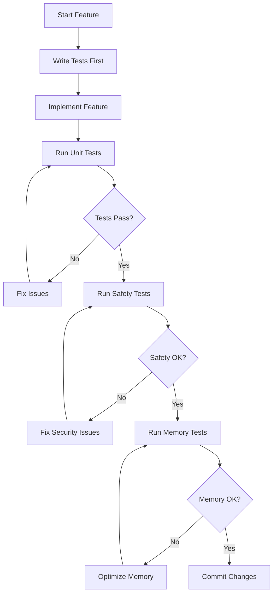
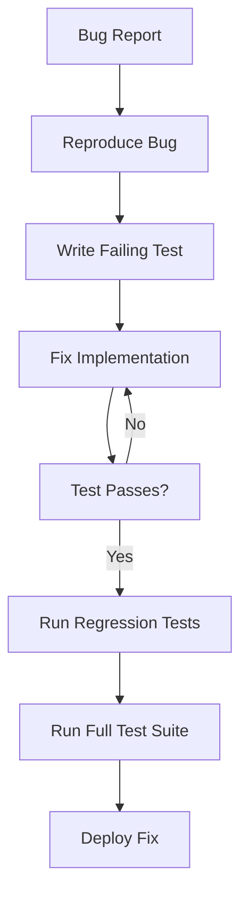
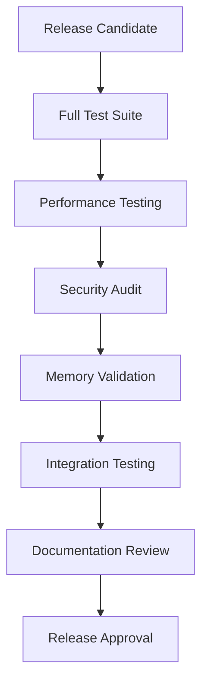
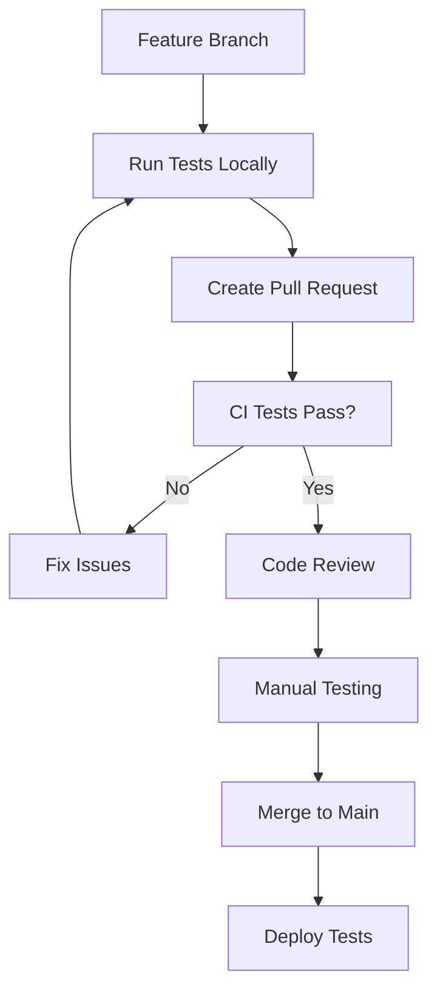

# 🔄 Testing Workflow Guide

*Streamlined testing workflows for QuillKernel development*

## Quick Start Commands

```bash
# Essential daily commands
make test-quick           # Fast safety checks (< 30s)
make test-memory         # Memory constraint validation  
make test-security       # Security validation
make test-full          # Complete test suite

# Development cycle
./tests/test-improvements.sh     # Before every commit
./tests/test-high-priority.sh    # Before every push
./tests/run-all-tests.sh         # Before deployment
```

---

## Development Workflows

### 🚀 Feature Development Workflow



#### Step-by-Step Process

**1. Pre-Development Setup**
```bash
# Verify environment
./tests/unit/toolchain/test-cross-compiler.sh
./tests/unit/memory/test-docker-memory-limit.sh

# Quick health check
./tests/test-improvements.sh
```

**2. Test-Driven Development**
```bash
# Create test for new feature
cp tests/unit/template.sh tests/unit/[category]/test-[feature].sh
# Edit test to define expected behavior
# Run test (should fail initially)
./tests/unit/[category]/test-[feature].sh
```

**3. Implementation**
```bash
# Implement feature
# Run specific test frequently
./tests/unit/[category]/test-[feature].sh

# Run related tests
./tests/unit/[category]/*.sh
```

**4. Validation**
```bash
# Safety validation
./tests/test-improvements.sh

# Memory validation  
./tests/unit/memory/*.sh

# Security validation
./tests/unit/menu/test-menu-input-validation.sh
```

**5. Integration Testing**
```bash
# Category-specific tests
./tests/unit/[category]/*.sh

# High-priority integration
./tests/test-high-priority.sh

# Full validation (before commit)
./tests/run-all-tests.sh
```

### 🔧 Bug Fix Workflow



#### Bug Fix Process

**1. Bug Reproduction**
```bash
# Create reproduction test
cat > tests/unit/bugs/test-bug-[id].sh << 'EOF'
#!/bin/bash
set -euo pipefail
source "$(dirname "$0")/../../test-framework.sh"

init_test "Bug [ID] Reproduction"

# Reproduce the bug condition
# This test should initially fail
EOF

# Verify bug exists
./tests/unit/bugs/test-bug-[id].sh
```

**2. Fix Implementation**
```bash
# Fix the bug
# Test continuously
./tests/unit/bugs/test-bug-[id].sh

# Ensure no regressions
./tests/unit/[affected-category]/*.sh
```

**3. Validation**
```bash
# Regression testing
./tests/test-high-priority.sh

# Full validation
./tests/run-all-tests.sh
```

### 🎯 Release Preparation Workflow



#### Release Process

**1. Pre-Release Testing**
```bash
# Complete test suite
time ./tests/run-all-tests.sh

# Performance validation
./tests/test-high-priority.sh

# Memory profiling
docker stats --no-stream nook-* || echo "No containers running"
```

**2. Security Audit**
```bash
# Security validation
./tests/unit/menu/test-menu-input-validation.sh
./tests/unit/menu/test-menu-error-handling.sh

# Code security review
find source/scripts -name "*.sh" -exec shellcheck {} \;
```

**3. Build Validation**
```bash
# Clean build
./build_kernel.sh

# Container validation
docker build -t nook-release -f minimal-boot.dockerfile .
docker run --rm nook-release echo "Release build successful"
```

**4. Documentation Check**
```bash
# Documentation tests
./tests/unit/docs/test-xda-research-docs.sh

# Verify all docs are current
find docs/ -name "*.md" -mtime +30 -ls
```

---

## Continuous Integration Workflows

### 🏭 CI Pipeline Configuration

```yaml
# .github/workflows/test.yml
name: QuillKernel Testing

on: [push, pull_request]

jobs:
  safety-tests:
    runs-on: ubuntu-latest
    steps:
      - uses: actions/checkout@v2
      - name: Script Safety Tests
        run: ./tests/test-improvements.sh
        
  unit-tests:
    runs-on: ubuntu-latest
    needs: safety-tests
    strategy:
      matrix:
        category: [boot, memory, modules, menu, toolchain, theme]
    steps:
      - uses: actions/checkout@v2
      - name: Unit Tests - ${{ matrix.category }}
        run: ./tests/unit/${{ matrix.category }}/*.sh
        
  integration-tests:
    runs-on: ubuntu-latest
    needs: unit-tests
    steps:
      - uses: actions/checkout@v2
      - name: Build Docker Images
        run: |
          docker build -t quillkernel-unified -f build/docker/kernel-xda-proven.dockerfile build/docker/
          docker build -t nook-mvp-rootfs -f minimal-boot.dockerfile .
      - name: Integration Tests
        run: ./tests/test-high-priority.sh
        
  performance-tests:
    runs-on: ubuntu-latest
    needs: integration-tests
    steps:
      - uses: actions/checkout@v2
      - name: Memory and Performance
        run: |
          ./tests/unit/memory/test-docker-memory-limit.sh
          docker stats --no-stream
```

### 🔄 Local CI Simulation

```bash
#!/bin/bash
# local-ci.sh - Simulate CI pipeline locally

echo "🏭 Local CI Pipeline Simulation"
echo "==============================="

# Stage 1: Safety Tests
echo "Stage 1: Safety Tests"
./tests/test-improvements.sh || exit 1

# Stage 2: Unit Tests
echo "Stage 2: Unit Tests"
for category in boot memory modules menu toolchain theme; do
    echo "  Testing category: $category"
    for test in tests/unit/$category/*.sh; do
        [[ -f "$test" ]] && "$test" || echo "  No tests in $category"
    done
done

# Stage 3: Integration Tests
echo "Stage 3: Integration Tests"
./tests/test-high-priority.sh || exit 1

# Stage 4: Performance Tests
echo "Stage 4: Performance Tests"
./tests/unit/memory/test-docker-memory-limit.sh || exit 1

echo "✅ Local CI simulation completed successfully!"
```

---

## Testing Environments

### 🖥️ Development Environment

**Characteristics:**
- Docker containers for isolation
- Fast feedback loops
- Memory limits may not be enforced
- E-Ink display simulation

**Setup:**
```bash
# Development environment setup
docker build -t quillkernel-unified -f build/docker/kernel-xda-proven.dockerfile build/docker/
docker build -t nook-mvp-rootfs -f minimal-boot.dockerfile .

# Environment validation
./tests/unit/toolchain/test-cross-compiler.sh
./tests/unit/memory/test-docker-memory-limit.sh
```

**Daily Commands:**
```bash
# Morning startup
./tests/test-improvements.sh

# During development
./tests/unit/[working-category]/*.sh

# Before breaks
./tests/test-high-priority.sh
```

### 🧪 Testing Environment

**Characteristics:**
- Mirrors production constraints
- Full memory limit enforcement
- Complete security validation
- Performance profiling

**Setup:**
```bash
# Testing environment configuration
export TEST_ENV=staging
export ENFORCE_MEMORY_LIMITS=true
export SECURITY_VALIDATION=strict

# Full environment validation
./tests/run-all-tests.sh
```

### 🚀 Production Environment

**Characteristics:**
- Actual Nook hardware
- Real E-Ink display
- True memory constraints
- USB host functionality

**Validation:**
```bash
# Production readiness check
./tests/test-high-priority.sh

# Hardware-specific tests (on device)
cat /proc/squireos/jester
cat /proc/squireos/typewriter/stats
fbink -c
```

---

## Team Workflows

### 👥 Code Review Process

**Reviewer Checklist:**
```bash
# Automated checks
./tests/test-improvements.sh     # Safety standards
./tests/run-all-tests.sh        # Full validation

# Manual review points
- [ ] Tests cover new functionality
- [ ] Memory usage within limits  
- [ ] Security validation included
- [ ] Medieval theme preserved
- [ ] Documentation updated
- [ ] Error handling comprehensive
```

**Review Commands:**
```bash
# Quick validation
./tests/test-high-priority.sh

# Security focus
./tests/unit/menu/test-menu-input-validation.sh

# Performance impact
./tests/unit/memory/*.sh
```

### 🔀 Merge Strategy



**Pre-Merge Requirements:**
- All CI tests pass
- Manual testing completed
- Performance impact assessed
- Security review completed
- Documentation updated

---

## Troubleshooting Workflows

### 🐛 Test Failure Analysis

```bash
#!/bin/bash
# test-failure-analysis.sh - Analyze test failures

echo "🔍 Test Failure Analysis"
echo "========================"

# Capture test output
./tests/run-all-tests.sh 2>&1 | tee test_output.log

# Analyze failures
echo "Failed Tests:"
grep -E "(FAIL|✗)" test_output.log | while read line; do
    echo "  ❌ $line"
done

# Performance issues
echo "Performance Issues:"
grep -E "(⏱️|Duration|exceeded)" test_output.log

# Security concerns
echo "Security Issues:"  
grep -E "(SECURITY|🛡️|malicious)" test_output.log

# Memory problems
echo "Memory Issues:"
grep -E "(memory|Memory|MB)" test_output.log
```

### 🔧 Environment Issues

**Docker Problems:**
```bash
# Docker service issues
sudo systemctl status docker

# Permission issues
sudo usermod -aG docker $USER
newgrp docker

# Image issues
docker images | grep -E "(quill|nook)"
docker build -t quillkernel-unified -f build/docker/kernel-xda-proven.dockerfile build/docker/
```

**Memory Testing Issues:**
```bash
# Memory limit enforcement varies by Docker setup
# Tests handle this gracefully by skipping when appropriate

# Check Docker memory configuration
docker info | grep -i memory

# Test memory detection manually
docker run --rm -m 256m ubuntu:20.04 free -m
```

**Permission Issues:**
```bash
# Fix test permissions
find tests/ -name "*.sh" -exec chmod +x {} \;

# Fix build permissions  
sudo chown -R $USER:$USER source/kernel/
```

---

## Performance Optimization

### ⚡ Fast Test Execution

**Quick Validation (< 30 seconds):**
```bash
# Essential safety checks
./tests/test-improvements.sh

# Critical functionality
./tests/unit/memory/test-docker-memory-limit.sh
./tests/unit/boot/test-boot-scripts-exist.sh
```

**Development Cycle (< 2 minutes):**
```bash
# Category-specific testing
./tests/unit/[working-category]/*.sh

# High-priority validation
./tests/test-high-priority.sh
```

**Pre-Commit (< 5 minutes):**
```bash
# Comprehensive validation
./tests/run-all-tests.sh
```

### 🎯 Targeted Testing

**Memory Changes:**
```bash
./tests/unit/memory/*.sh
./tests/test-high-priority.sh
```

**Script Changes:**
```bash
./tests/test-improvements.sh
./tests/unit/menu/test-menu-input-validation.sh
```

**Module Changes:**
```bash
./tests/unit/modules/*.sh
./tests/unit/toolchain/test-cross-compiler.sh
```

**Theme Changes:**
```bash
./tests/unit/theme/*.sh
```

---

## Documentation Integration

### 📚 Test Documentation

**Updating Documentation:**
```bash
# Document new tests
echo "- test-[feature].sh: [description]" >> docs/TEST_INVENTORY.md

# Update workflow docs when adding new categories
# Update framework docs when adding new functions
```

**Documentation Tests:**
```bash
# Verify documentation completeness
./tests/unit/docs/test-xda-research-docs.sh

# Check for outdated documentation
find docs/ -name "*.md" -mtime +60 -ls
```

---

## Conclusion

This workflow guide provides:

- **Clear processes** for different development scenarios
- **Fast feedback loops** for efficient development
- **Comprehensive validation** for quality assurance
- **Team coordination** for collaborative development
- **Troubleshooting guidance** for common issues

**Remember the QuillKernel motto:** *"By quill and candlelight, quality prevails!"*

The testing workflows ensure that every change maintains the high quality standards expected for a writing device that serves medieval scribes in the digital age.

---

*Testing Workflow Guide v1.0*  
*Streamlined processes for QuillKernel quality assurance* 🕯️📜