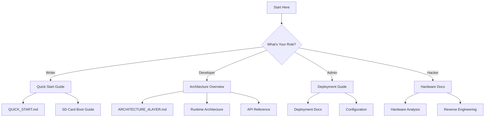

# 🗺️ JoKernel Project Navigation Map
*Visual navigation guide with cross-references*

## 🎯 Start Here Based on Your Role



## 📚 Index Hierarchy

### Level 1: Master Indices
```
COMPREHENSIVE_PROJECT_INDEX.md ← YOU ARE HERE (Master)
    ├── PROJECT_INDEX.md (Main Navigation)
    ├── DOCUMENTATION_INDEX.md (All Docs)
    ├── ANALYSIS_QUICK_REFERENCE.md (20 Reports)
    └── RUNTIME_ARCHITECTURE_INDEX.md (4-Layer Guide)
```

### Level 2: Category Indices
```
docs/00-indexes/
    ├── README.md (Documentation Hub)
    ├── comprehensive-index.md (File Listing)
    ├── navigation-guide.md (How to Navigate)
    └── reorganization-summary.md (Doc Structure)
```

## 🔀 Cross-Reference Network

### By Topic Area

#### 🏗️ Architecture
- Design: [ARCHITECTURE_4LAYER.md](ARCHITECTURE_4LAYER.md)
- Analysis: [ARCHITECTURE_ANALYSIS_REPORT.md](ARCHITECTURE_ANALYSIS_REPORT.md)
- Runtime: [RUNTIME_ARCHITECTURE_INDEX.md](RUNTIME_ARCHITECTURE_INDEX.md)
- Migration: [ARCHITECTURE_MIGRATION_GUIDE.md](ARCHITECTURE_MIGRATION_GUIDE.md)

#### 🔧 Hardware
- Overview: [docs/hardware/README.md](docs/hardware/README.md)
- Buttons: [BUTTON_NAVIGATION_ANALYSIS.md](BUTTON_NAVIGATION_ANALYSIS.md)
- Sensors: [NOOK_SENSOR_ANALYSIS.md](NOOK_SENSOR_ANALYSIS.md)
- Power: [POWER_MANAGEMENT_ANALYSIS.md](POWER_MANAGEMENT_ANALYSIS.md)
- USB: [USB_OTG_ANALYSIS.md](USB_OTG_ANALYSIS.md)

#### 💻 Development
- Build System: [docs/02-build/](docs/02-build/)
- API Reference: [docs/05-api-reference/](docs/05-api-reference/)
- Testing: [docs/08-testing/](docs/08-testing/)
- Tools: [tools/](tools/)

#### 🚀 Deployment
- Guide: [docs/07-deployment/deployment-documentation.md](docs/07-deployment/deployment-documentation.md)
- Estimates: [DEPLOYMENT_ESTIMATE.md](DEPLOYMENT_ESTIMATE.md)
- SD Card: [docs/01-getting-started/sd-card-boot-guide.md](docs/01-getting-started/sd-card-boot-guide.md)

## 🔍 Quick Lookups

### Find Configuration Files
```
Runtime Config:     runtime/configs/
System Config:      runtime/configs/system/
Vim Config:         runtime/configs/vim/
Build Config:       build.conf
Makefile:          Makefile
```

### Find Scripts
```
Boot Scripts:       runtime/init/
Menu Scripts:       runtime/1-ui/menu/
Service Scripts:    runtime/2-application/jesteros/
Hardware Scripts:   runtime/4-hardware/
Build Scripts:      build/scripts/
Test Scripts:       tests/
```

### Find Documentation
```
Getting Started:    docs/01-getting-started/
Build Docs:         docs/02-build/
JesterOS Docs:      docs/03-jesteros/
Kernel Docs:        docs/04-kernel/
API Docs:           docs/05-api-reference/
Config Docs:        docs/06-configuration/
Deploy Docs:        docs/07-deployment/
Testing Docs:       docs/08-testing/
UI Design:          docs/09-ui-design/
Troubleshooting:    docs/10-troubleshooting/
```

## 📊 Document Relationships

### Core Documents Flow
```
README.md
    ├── QUICK_START.md
    │   └── docs/01-getting-started/
    ├── CLAUDE.md (AI Guidelines)
    │   └── Development Philosophy
    └── PROJECT_INDEX.md
        ├── DOCUMENTATION_INDEX.md
        ├── RUNTIME_ARCHITECTURE_INDEX.md
        └── ANALYSIS_QUICK_REFERENCE.md
```

### Analysis Document Network
```
ARCHITECTURE_ANALYSIS_REPORT.md (Hub)
    ├── Hardware Branch
    │   ├── BUTTON_NAVIGATION_ANALYSIS.md
    │   ├── NOOK_SENSOR_ANALYSIS.md
    │   ├── POWER_MANAGEMENT_ANALYSIS.md
    │   └── USB_OTG_ANALYSIS.md
    ├── System Branch
    │   ├── BOOT_CONSISTENCY_ANALYSIS.md
    │   ├── KERNEL_COMPILATION_DESIGN.md
    │   └── ROOT_FILESYSTEM_ANALYSIS.md
    └── Quality Branch
        ├── SCRIPT_QUALITY_REPORT.md
        ├── SECURITY_IMPROVEMENTS_SUMMARY.md
        └── TEST_REPORT.md
```

## 🎨 Visual Project Map

```
JoKernel Project
│
├── 📖 Documentation Layer
│   ├── Indices (5 files)
│   ├── Analysis (20 reports)
│   └── Guides (77+ docs)
│
├── 🏛️ Runtime Layer
│   ├── Layer 1: UI (7 components)
│   ├── Layer 2: App (9 components)
│   ├── Layer 3: System (3 libs)
│   └── Layer 4: Hardware (6 interfaces)
│
├── 🔧 Development Layer
│   ├── Build System
│   ├── Docker Environments
│   └── Tools & Scripts
│
└── 🚀 Deployment Layer
    ├── Packages
    ├── Images
    └── Releases
```

## 🔗 External References

### GitHub Resources
- Repository: [Main Repo URL]
- Issues: [Issue Tracker]
- Wiki: [Project Wiki]

### Related Projects
- FBInk: E-Ink display library
- Debian ARM: Base system
- Linux 2.6.29: Kernel version

## 📍 Navigation Tips

### Use Indices for:
- **Overview**: COMPREHENSIVE_PROJECT_INDEX.md
- **Quick Nav**: PROJECT_INDEX.md
- **All Docs**: DOCUMENTATION_INDEX.md
- **Analysis**: ANALYSIS_QUICK_REFERENCE.md
- **Runtime**: RUNTIME_ARCHITECTURE_INDEX.md

### Search Patterns:
- Scripts: `**/*.sh`
- Docs: `**/*.md`
- Configs: `**/*.conf`, `**/*.vim`
- Docker: `**/*.dockerfile`

### Key Directories:
- Runtime: `runtime/`
- Docs: `docs/`
- Tools: `tools/`
- Tests: `tests/`
- Build: `build/`

## 🏁 Quick Actions

### I want to...
- **Start writing**: [QUICK_START.md](QUICK_START.md)
- **Understand architecture**: [ARCHITECTURE_4LAYER.md](ARCHITECTURE_4LAYER.md)
- **Deploy to device**: [docs/07-deployment/](docs/07-deployment/)
- **Fix an issue**: [docs/10-troubleshooting/](docs/10-troubleshooting/)
- **Run tests**: [tests/README.md](tests/README.md)
- **Build from source**: [docs/02-build/](docs/02-build/)

---

*"Navigate with confidence through the JoKernel realm!"* 🧭📜