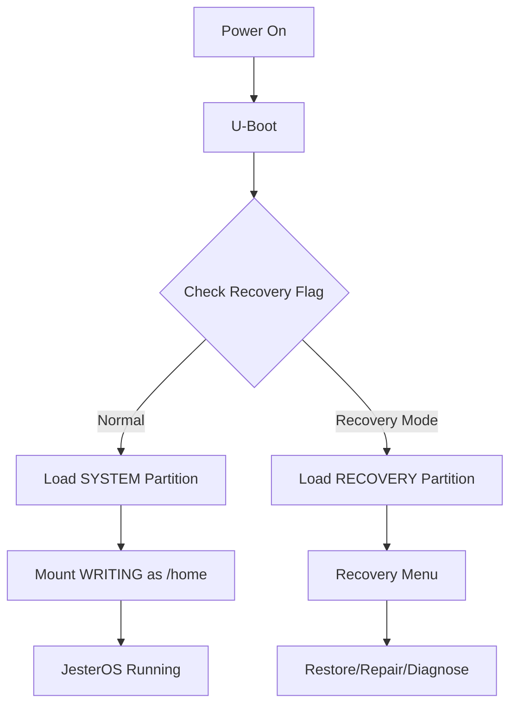

# JesterOS 4-Partition SD Card Strategy
*Resilient Storage Architecture for Nook Simple Touch*

## 📋 Executive Summary

A 4-partition SD card layout providing system protection, user data isolation, and automatic recovery capabilities for JesterOS.

---

## 🗂️ Partition Layout

```
SD Card Layout (8GB minimum, 16-32GB recommended):
┌──────────────────────────────────────────────┐
│ Partition 1: BOOT (64MB, FAT32)             │
│ - Primary boot files                         │
│ - Kernel image (uImage)                      │
│ - Boot configuration                         │
│ - Emergency boot scripts                     │
├──────────────────────────────────────────────┤
│ Partition 2: SYSTEM (1.5GB, ext4)           │
│ - Active JesterOS root filesystem            │
│ - /usr, /bin, /lib, /etc                    │
│ - Vim and writing tools                      │
│ - Jester services                            │
├──────────────────────────────────────────────┤
│ Partition 3: RECOVERY (1.5GB, ext4)         │
│ - Factory JesterOS image                     │
│ - Recovery tools and scripts                 │
│ - Diagnostic utilities                       │
│ - Backup configurations                      │
├──────────────────────────────────────────────┤
│ Partition 4: WRITING (remaining, ext4)      │
│ - User home directory                        │
│ - Documents, drafts, notes                   │
│ - Personal configurations                    │
│ - Writing statistics/history                 │
└──────────────────────────────────────────────┘
```

---

## 💾 Size Allocations

### 8GB SD Card
```yaml
Partition 1 (BOOT):     64MB   (0.8%)
Partition 2 (SYSTEM):   1.5GB  (18.7%)
Partition 3 (RECOVERY): 1.5GB  (18.7%)
Partition 4 (WRITING):  4.9GB  (61.8%)
```

### 16GB SD Card
```yaml
Partition 1 (BOOT):     64MB   (0.4%)
Partition 2 (SYSTEM):   1.5GB  (9.4%)
Partition 3 (RECOVERY): 1.5GB  (9.4%)
Partition 4 (WRITING):  12.9GB (80.8%)
```

### 32GB SD Card
```yaml
Partition 1 (BOOT):     64MB   (0.2%)
Partition 2 (SYSTEM):   2GB    (6.2%)
Partition 3 (RECOVERY): 2GB    (6.2%)
Partition 4 (WRITING):  27.9GB (87.4%)
```

---

## 🚀 Boot Flow & Recovery Mechanism

### Normal Boot Sequence


### Recovery Triggers
1. **Hardware Button**: Hold power + home during boot
2. **Software Flag**: `/boot/RECOVERY_MODE` file presence
3. **Corruption Detection**: Checksum failure on SYSTEM partition
4. **User Request**: Menu option in JesterOS
5. **Auto-Recovery**: 3 failed boots trigger recovery

---

## 🛡️ Recovery Partition Features

### Contents Structure
```
/recovery/
├── images/
│   ├── jesteros-v1.0.img    # Factory image
│   ├── jesteros-v1.1.img    # Updates
│   └── checksums.md5        # Integrity verification
├── tools/
│   ├── restore.sh           # Full system restore
│   ├── repair.sh            # Filesystem repair
│   ├── backup.sh            # User data backup
│   └── diagnose.sh          # Hardware testing
├── config/
│   ├── factory-defaults/    # Original configs
│   ├── user-backup/         # Saved user settings
│   └── recovery.conf        # Recovery options
└── logs/
    └── recovery.log         # Recovery history
```

### Recovery Menu Options
```
╔══════════════════════════════════════╗
║     JesterOS Recovery Mode v1.0      ║
╠══════════════════════════════════════╣
║ 1. Factory Reset (keep writings)     ║
║ 2. Full System Restore               ║
║ 3. Repair Filesystem                 ║
║ 4. Backup User Data                  ║
║ 5. Hardware Diagnostics              ║
║ 6. View Recovery Logs                ║
║ 7. Advanced Options                  ║
║ 8. Reboot to Normal Mode             ║
╚══════════════════════════════════════╝
```

---

## 📝 Partition Creation Script

```bash
#!/bin/bash
# create-jesteros-4part-sdcard.sh
set -euo pipefail

# Configuration
DEVICE="${1:-/dev/mmcblk1}"
CARD_SIZE=$(blockdev --getsize64 $DEVICE | awk '{print int($1/1024/1024/1024)}')

# Validate minimum size
if [ "$CARD_SIZE" -lt 8 ]; then
    echo "Error: SD card must be at least 8GB"
    exit 1
fi

# Calculate partition sizes based on card size
if [ "$CARD_SIZE" -ge 32 ]; then
    SYSTEM_SIZE="2048MiB"
    RECOVERY_SIZE="2048MiB"
elif [ "$CARD_SIZE" -ge 16 ]; then
    SYSTEM_SIZE="1536MiB"
    RECOVERY_SIZE="1536MiB"
else
    SYSTEM_SIZE="1536MiB"
    RECOVERY_SIZE="1536MiB"
fi

echo "Creating 4-partition layout on $DEVICE (${CARD_SIZE}GB)..."

# Unmount any existing partitions
umount ${DEVICE}p* 2>/dev/null || true

# Create new partition table
parted -s $DEVICE mklabel msdos

# Partition 1: BOOT (64MB FAT32)
echo "Creating BOOT partition..."
parted -s $DEVICE mkpart primary fat32 1MiB 65MiB
parted -s $DEVICE set 1 boot on
mkfs.vfat -n BOOT ${DEVICE}p1

# Partition 2: SYSTEM (1.5-2GB ext4)
echo "Creating SYSTEM partition..."
parted -s $DEVICE mkpart primary ext4 65MiB $SYSTEM_SIZE
mkfs.ext4 -L JESTEROS ${DEVICE}p2
tune2fs -c 0 -i 0 ${DEVICE}p2  # Disable fsck by count/time

# Partition 3: RECOVERY (1.5-2GB ext4)
RECOVERY_START=$SYSTEM_SIZE
RECOVERY_END=$(echo "$SYSTEM_SIZE" | sed 's/MiB//' | awk '{print $1*2"MiB"}')
echo "Creating RECOVERY partition..."
parted -s $DEVICE mkpart primary ext4 $RECOVERY_START $RECOVERY_END
mkfs.ext4 -L RECOVERY ${DEVICE}p3
tune2fs -c 0 -i 0 ${DEVICE}p3

# Partition 4: WRITING (remaining ext4)
echo "Creating WRITING partition..."
parted -s $DEVICE mkpart primary ext4 $RECOVERY_END 100%
mkfs.ext4 -L WRITING ${DEVICE}p4
tune2fs -c 0 -i 0 ${DEVICE}p4

# Create mount points and initial structure
MOUNT_BASE="/tmp/jesteros_setup"
mkdir -p $MOUNT_BASE/{boot,system,recovery,writing}

# Mount and initialize BOOT
mount ${DEVICE}p1 $MOUNT_BASE/boot
cat > $MOUNT_BASE/boot/boot.txt << 'EOF'
# JesterOS Boot Configuration
# Recovery mode: Create RECOVERY_MODE file here
# Normal boot: Remove RECOVERY_MODE file
BOOT_MODE=normal
SYSTEM_PARTITION=/dev/mmcblk1p2
RECOVERY_PARTITION=/dev/mmcblk1p3
WRITING_PARTITION=/dev/mmcblk1p4
EOF

# Mount and initialize RECOVERY
mount ${DEVICE}p3 $MOUNT_BASE/recovery
mkdir -p $MOUNT_BASE/recovery/{images,tools,config,logs}

# Create recovery launcher
cat > $MOUNT_BASE/recovery/tools/recovery-menu.sh << 'EOF'
#!/bin/bash
# JesterOS Recovery Menu

show_menu() {
    clear
    echo "╔══════════════════════════════════════╗"
    echo "║     JesterOS Recovery Mode v1.0      ║"
    echo "╠══════════════════════════════════════╣"
    echo "║ 1. Factory Reset (keep writings)     ║"
    echo "║ 2. Full System Restore               ║"
    echo "║ 3. Repair Filesystem                 ║"
    echo "║ 4. Backup User Data                  ║"
    echo "║ 5. Hardware Diagnostics              ║"
    echo "║ 6. View Recovery Logs                ║"
    echo "║ 7. Advanced Options                  ║"
    echo "║ 8. Reboot to Normal Mode             ║"
    echo "╚══════════════════════════════════════╝"
    echo -n "Select option: "
}

factory_reset() {
    echo "Performing factory reset..."
    dd if=/recovery/images/jesteros-factory.img of=/dev/mmcblk1p2 bs=4M
    echo "Factory reset complete. User data preserved."
}

while true; do
    show_menu
    read choice
    case $choice in
        1) factory_reset ;;
        8) rm -f /boot/RECOVERY_MODE && reboot ;;
        *) echo "Invalid option" ;;
    esac
done
EOF
chmod +x $MOUNT_BASE/recovery/tools/recovery-menu.sh

# Unmount all
umount $MOUNT_BASE/{boot,recovery} 2>/dev/null || true

echo "✅ 4-partition SD card created successfully!"
echo ""
echo "Partition Layout:"
parted -s $DEVICE print
echo ""
echo "Next steps:"
echo "1. Install JesterOS to partition 2 (SYSTEM)"
echo "2. Copy recovery image to partition 3 (RECOVERY)"
echo "3. Boot your Nook with this SD card"
```

---

## 🔧 Mount Configuration

### /etc/fstab (Normal Boot)
```bash
# JesterOS 4-Partition Mount Configuration
# <device>          <mount>     <type>  <options>                    <dump> <pass>
/dev/mmcblk1p2     /           ext4    ro,noatime,errors=remount-ro  0      1
/dev/mmcblk1p4     /home       ext4    rw,noatime,commit=600          0      2
/dev/mmcblk1p1     /boot       vfat    rw,noatime,fmask=0022          0      0

# RAM disks for temporary files (save SD writes)
tmpfs              /tmp        tmpfs   size=32M,mode=1777             0      0
tmpfs              /var/log    tmpfs   size=8M,mode=0755              0      0
tmpfs              /var/tmp    tmpfs   size=16M,mode=1777             0      0

# Recovery partition (not mounted by default)
# /dev/mmcblk1p3   /recovery   ext4    ro,noauto                      0      0
```

### /etc/fstab (Recovery Boot)
```bash
# Recovery Mode Mount Configuration
/dev/mmcblk1p3     /           ext4    ro,noatime                     0      1
/dev/mmcblk1p4     /mnt/user   ext4    rw,noatime                     0      0
/dev/mmcblk1p2     /mnt/system ext4    rw,noatime                     0      0
/dev/mmcblk1p1     /boot       vfat    rw,noatime                     0      0
tmpfs              /tmp        tmpfs   size=64M                       0      0
```

---

## 🛠️ Recovery Implementation

### Auto-Recovery Detection
```bash
#!/bin/bash
# /usr/local/bin/boot-selector.sh
# Runs early in boot to determine partition

BOOT_COUNT_FILE="/boot/.boot_count"
RECOVERY_FLAG="/boot/RECOVERY_MODE"
MAX_FAILURES=3

# Check for recovery flag
if [ -f "$RECOVERY_FLAG" ]; then
    echo "Recovery mode requested"
    exec switch_root /recovery /sbin/init
fi

# Check boot counter for auto-recovery
if [ -f "$BOOT_COUNT_FILE" ]; then
    COUNT=$(cat "$BOOT_COUNT_FILE")
    if [ "$COUNT" -ge "$MAX_FAILURES" ]; then
        echo "Boot failures detected, entering recovery"
        echo 0 > "$BOOT_COUNT_FILE"
        exec switch_root /recovery /sbin/init
    fi
    echo $((COUNT + 1)) > "$BOOT_COUNT_FILE"
else
    echo 1 > "$BOOT_COUNT_FILE"
fi

# Normal boot
exec switch_root /system /sbin/init
```

### System Backup Script
```bash
#!/bin/bash
# /recovery/tools/backup.sh

BACKUP_DIR="/mnt/user/.backups"
TIMESTAMP=$(date +%Y%m%d_%H%M%S)
BACKUP_FILE="$BACKUP_DIR/jesteros_backup_$TIMESTAMP.tar.gz"

echo "Creating system backup..."
mkdir -p "$BACKUP_DIR"

# Backup user configurations and data
tar -czf "$BACKUP_FILE" \
    --exclude="*.tmp" \
    --exclude=".cache" \
    /mnt/user/documents \
    /mnt/user/.vim \
    /mnt/user/.vimrc \
    /mnt/user/.jesteros

echo "Backup complete: $BACKUP_FILE"
echo "Size: $(du -h "$BACKUP_FILE" | cut -f1)"

# Keep only last 5 backups
ls -t "$BACKUP_DIR"/jesteros_backup_*.tar.gz | tail -n +6 | xargs rm -f 2>/dev/null
```

---

## 📊 Performance Optimization

### Write Optimization
```bash
# Optimize SD card writes for each partition

# BOOT: Minimal writes, sync important
mount -o remount,sync /boot

# SYSTEM: Read-only except updates
mount -o remount,ro /

# RECOVERY: Read-only always
mount -o remount,ro /recovery

# WRITING: Optimized for frequent writes
mount -o remount,noatime,nodiratime,commit=600 /home

# Set optimal I/O scheduler
echo deadline > /sys/block/mmcblk1/queue/scheduler
echo 256 > /sys/block/mmcblk1/queue/read_ahead_kb
```

### Wear Leveling Strategy
- BOOT: Rarely written (< 10 writes/year)
- SYSTEM: Written only during updates
- RECOVERY: Written only during factory setup
- WRITING: All user writes concentrated here

---

## 🎯 Benefits

### 1. **Bulletproof Recovery**
- Hardware button recovery trigger
- Automatic corruption detection
- Factory reset without data loss
- Multiple recovery options

### 2. **Data Protection**
- System and user data fully separated
- User data survives all recovery operations
- Automatic backup capabilities
- Filesystem corruption isolation

### 3. **Update Safety**
- Safe system updates (rollback possible)
- A/B update capability (SYSTEM/RECOVERY swap)
- Factory image always available
- User data never touched by updates

### 4. **Maintenance**
- Built-in diagnostic tools
- Filesystem repair utilities
- Performance optimization scripts
- Usage statistics tracking

---

## 🚨 Emergency Recovery Procedures

### Level 1: Software Recovery
```bash
# From JesterOS menu
Select: System > Recovery Mode > Enter Recovery
```

### Level 2: Boot Flag Recovery
```bash
# From any Linux system
mount /dev/mmcblk1p1 /mnt
touch /mnt/RECOVERY_MODE
umount /mnt
# Reboot - will enter recovery
```

### Level 3: Hardware Recovery
```
1. Power off Nook
2. Hold [Home] button
3. Press [Power] button
4. Keep holding [Home] for 5 seconds
5. Recovery menu appears
```

### Level 4: SD Card Recovery
```
1. Remove SD card from Nook
2. Insert into computer
3. Mount recovery partition
4. Run recovery tools directly
5. Fix issues and reinsert
```

---

## 🎭 The Jester's Wisdom

```
    .-.
   (o o)  "Four partitions strong and true,
   | O |   Boot and System, Recovery too,
    '-'    And Writing space for all your art,
           Protected by a recovery heart!
           
           Should gremlins strike your system down,
           Recovery mode will come around,
           Your writings safe, your system healed,
           The jester's promise, forever sealed!"
```

---

## Summary

The 4-partition strategy provides:

1. **BOOT**: Minimal, reliable boot control
2. **SYSTEM**: Protected, read-only operation system  
3. **RECOVERY**: Complete restoration capability
4. **WRITING**: Massive, protected user space

This design ensures JesterOS is virtually indestructible while maximizing writing space and system reliability.

**Key Innovation**: The recovery partition acts as both factory reset source AND potential A/B update target, enabling safe system updates with instant rollback capability.

---

*Partition Strategy v2.0*  
*JesterOS Storage Architecture*  
*"Built to survive, designed to write"*