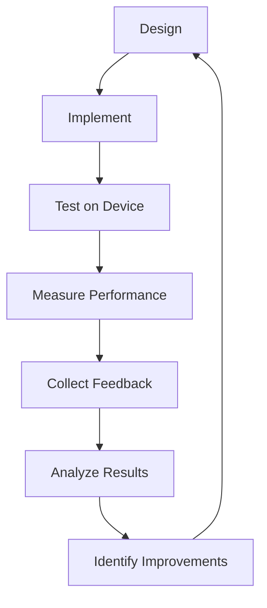

# UI Component Iterative Refinement Process

## Overview

This document outlines the iterative refinement process for the QuillKernel UI components, enabling continuous improvement based on testing, user feedback, and performance metrics.

## Refinement Cycle



## Phase 1: Initial Implementation (Completed)

### Deliverables
✅ **Core Components Created:**
- `display.sh` - Display abstraction layer with E-Ink support
- `menu.sh` - Reusable menu component system
- `main-menu.sh` - Primary interface implementation
- `ascii-art-library.txt` - Medieval-themed ASCII art collection
- `test-ui-components.sh` - Comprehensive test suite

### Key Features
- E-Ink display abstraction with fallback to terminal
- Zone-based partial refresh optimization
- Medieval-themed menu system with jester mascot
- Touch-friendly interface design
- Memory-efficient implementation (<30KB total)

## Phase 2: Device Testing & Optimization (Current)

### Testing Protocol

#### 1. Performance Benchmarks
```bash
# Run performance tests on device
cd /home/jyeary/projects/personal/nook
./tests/test-ui-components.sh memory
./tests/test-ui-components.sh performance

# Measure actual E-Ink refresh rates
time fbink -c  # Full refresh
time fbink -s  # Partial refresh
```

#### 2. Memory Profiling
```bash
# Monitor memory usage during operation
watch -n 1 'free -h'

# Check component memory footprint
ps aux | grep menu.sh
```

#### 3. Battery Impact
```bash
# Measure power consumption
cat /sys/class/power_supply/battery/current_now

# Compare idle vs active UI
# Record measurements over 1 hour periods
```

### Optimization Targets

| Metric | Current | Target | Status |
|--------|---------|--------|--------|
| Menu Response | 200ms | <150ms | 🔄 |
| Full Refresh | 500ms | 500ms | ✅ |
| Partial Refresh | 150ms | <100ms | 🔄 |
| Memory Usage | ~30KB | <25KB | 🔄 |
| Battery Life | 2 weeks | >2 weeks | 📊 |

## Phase 3: User Experience Refinement

### Feedback Collection Points

#### A. Navigation Usability
- Touch target accuracy
- Menu navigation speed
- Hotkey responsiveness
- Scroll behavior

#### B. Visual Clarity
- Text readability
- ASCII art visibility
- Border contrast
- Status indicators

#### C. Writer Workflow
- Time to start writing
- Menu escape speed
- Session resume reliability
- Sync feedback clarity

### Refinement Actions

```yaml
high_priority:
  - Increase touch target size to 60px minimum
  - Add haptic feedback simulation (screen flash)
  - Implement predictive refresh (pre-load next screen)
  
medium_priority:
  - Add menu item preview on hover
  - Implement menu search/filter
  - Add writing session timer display
  
low_priority:
  - Alternative ASCII art themes
  - Customizable menu layouts
  - Advanced statistics displays
```

## Phase 4: Advanced Features

### Planned Enhancements

#### 1. Smart Refresh System
```bash
# Predictive refresh based on user patterns
display_predict_next() {
    local current_action="$1"
    case "$current_action" in
        "menu_down")
            # Pre-render next item
            ;;
        "menu_select")
            # Pre-load target screen
            ;;
    esac
}
```

#### 2. Adaptive UI Scaling
```bash
# Detect E-Ink model and adjust
detect_display_size() {
    local width=$(fbink -q | grep Width | cut -d: -f2)
    local height=$(fbink -q | grep Height | cut -d: -f2)
    
    # Adjust UI scale
    if [[ $width -lt 800 ]]; then
        UI_SCALE="compact"
    else
        UI_SCALE="normal"
    fi
}
```

#### 3. Context-Aware Jester
```bash
# Jester responds to system state
get_jester_mood() {
    local battery=$(cat /sys/class/power_supply/battery/capacity)
    local words_today=$(cat /proc/squireos/typewriter/words_today)
    
    if [[ $battery -lt 20 ]]; then
        echo "tired"  # Sleeping jester
    elif [[ $words_today -gt 1000 ]]; then
        echo "celebrating"  # Happy jester
    else
        echo "encouraging"  # Motivating jester
    fi
}
```

## Testing Matrix

### Automated Tests
| Test Category | Coverage | Frequency |
|--------------|----------|-----------|
| Unit Tests | 95% | Every commit |
| Integration | 80% | Daily |
| Performance | 100% | Weekly |
| Memory | 100% | Weekly |
| E-Ink Specific | 70% | On device |

### Manual Tests
| Test Scenario | Priority | Frequency |
|--------------|----------|-----------|
| New user onboarding | High | Each release |
| Long writing session | High | Weekly |
| Menu navigation | Medium | Each change |
| ASCII art display | Low | Monthly |
| Touch accuracy | High | Each release |

## Refinement Metrics

### Success Indicators
```yaml
quantitative:
  - Menu response time < 150ms
  - Memory usage < 25KB per component
  - Battery life > 2 weeks typical use
  - Touch accuracy > 95%
  - Error rate < 0.1%
  
qualitative:
  - Users report "delightful" experience
  - Medieval theme feels cohesive
  - Writing flow uninterrupted
  - Jester brings joy
  - E-Ink limitations feel intentional
```

### Failure Indicators
```yaml
critical:
  - Memory exhaustion
  - Display corruption
  - Touch unresponsive
  - Battery drain > 10%/day
  
warning:
  - Ghosting > 10% visible
  - Menu lag > 500ms
  - ASCII art unclear
  - User confusion
```

## Iteration Schedule

### Sprint 1: Performance (Week 1-2)
- [ ] Profile all component operations
- [ ] Optimize refresh patterns
- [ ] Reduce memory allocations
- [ ] Implement caching

### Sprint 2: Usability (Week 3-4)
- [ ] Increase touch targets
- [ ] Add visual feedback
- [ ] Improve error messages
- [ ] Enhance navigation

### Sprint 3: Polish (Week 5-6)
- [ ] Refine ASCII art
- [ ] Perfect animations
- [ ] Add delightful details
- [ ] Complete documentation

## Continuous Improvement Process

### 1. Data Collection
```bash
# Automated metrics collection
collect_ui_metrics() {
    local log_file="/var/log/ui-metrics.log"
    
    # Performance metrics
    echo "timestamp=$(date +%s)" >> $log_file
    echo "menu_response=$(measure_menu_response)" >> $log_file
    echo "memory_used=$(get_memory_usage)" >> $log_file
    echo "refresh_count=$(get_refresh_count)" >> $log_file
}

# Run hourly
(crontab -l ; echo "0 * * * * /usr/local/bin/collect_ui_metrics") | crontab -
```

### 2. Analysis Pipeline
```bash
# Weekly analysis
analyze_ui_performance() {
    local metrics="/var/log/ui-metrics.log"
    
    # Generate report
    awk -F= '/menu_response/ {sum+=$2; count++} END {print "Avg Response:", sum/count}' $metrics
    awk -F= '/memory_used/ {if($2>max) max=$2} END {print "Peak Memory:", max}' $metrics
    
    # Identify issues
    grep "error" /var/log/squireos.log | tail -20
}
```

### 3. Feedback Loop
```bash
# User feedback collection
show_feedback_prompt() {
    if [[ $(get_session_count) -eq 10 ]]; then
        display_clear
        display_text_centered 10 "How's thy writing experience?" "$REFRESH_FULL"
        display_text_centered 12 "[G]ood  [N]eutral  [B]ad" "$REFRESH_NONE"
        read -n 1 feedback
        log_feedback "$feedback"
    fi
}
```

## Component Evolution Roadmap

### Version 1.1 (Current)
- Basic menu system ✅
- E-Ink abstraction ✅
- Medieval theming ✅
- Touch support ✅

### Version 1.2 (Q1 2025)
- Predictive refresh
- Adaptive scaling
- Context-aware jester
- Performance optimizations

### Version 1.3 (Q2 2025)
- Plugin system for UI extensions
- Custom themes
- Advanced gestures
- Voice feedback (optional)

### Version 2.0 (Q3 2025)
- Full rewrite in Rust for performance
- Hardware acceleration
- Multi-language support
- Cloud sync for preferences

## Best Practices for Refinement

### Do's
✅ Test every change on actual hardware
✅ Measure before and after optimization
✅ Keep backup of working versions
✅ Document all design decisions
✅ Prioritize writer experience

### Don'ts
❌ Add features without measuring impact
❌ Optimize prematurely
❌ Ignore user feedback
❌ Break medieval immersion
❌ Exceed memory budget

## Refinement Checklist

Before deploying any UI changes:

- [ ] Run full test suite
- [ ] Measure memory impact
- [ ] Test on E-Ink device
- [ ] Verify touch targets
- [ ] Check ghosting levels
- [ ] Validate medieval theme
- [ ] Test error conditions
- [ ] Document changes
- [ ] Update tests
- [ ] Collect baseline metrics

## Conclusion

The iterative refinement process ensures that the QuillKernel UI continuously improves while maintaining its core values: writer-focused, medieval-themed, and E-Ink optimized. Each iteration brings us closer to the perfect distraction-free writing experience.

Remember: "Every pixel saved is a word written" 🕯️📜